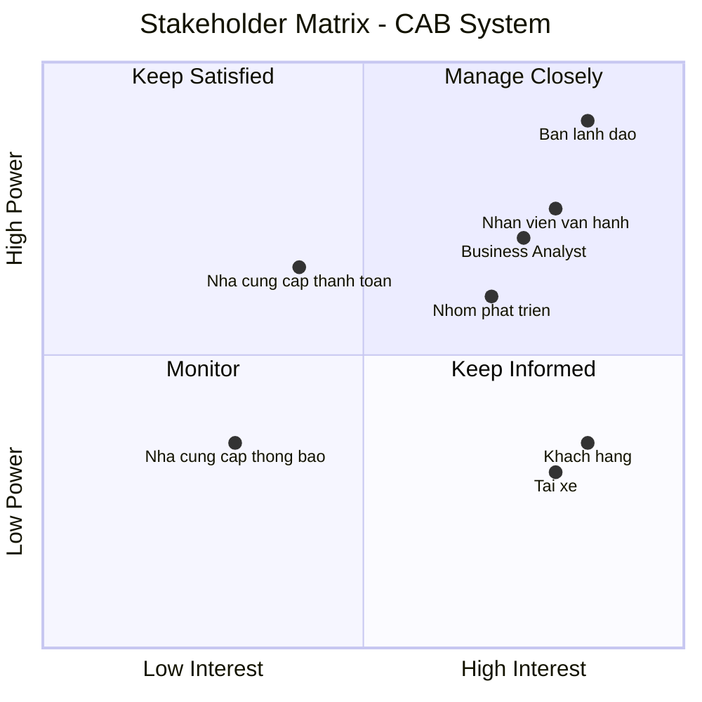
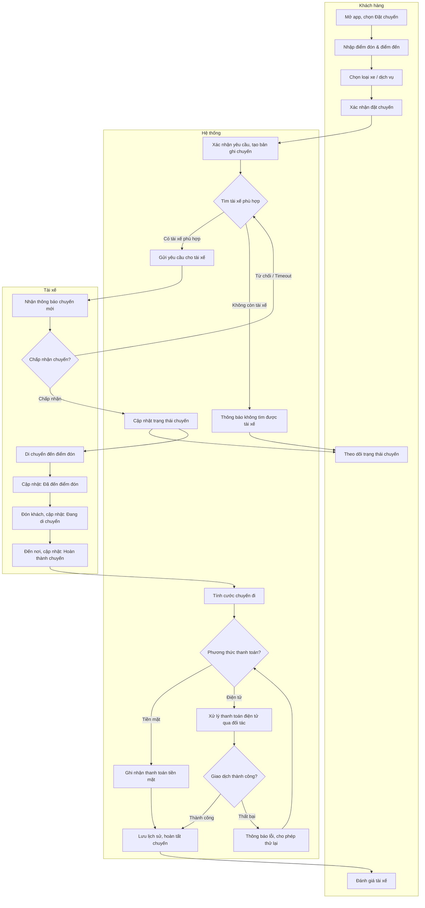
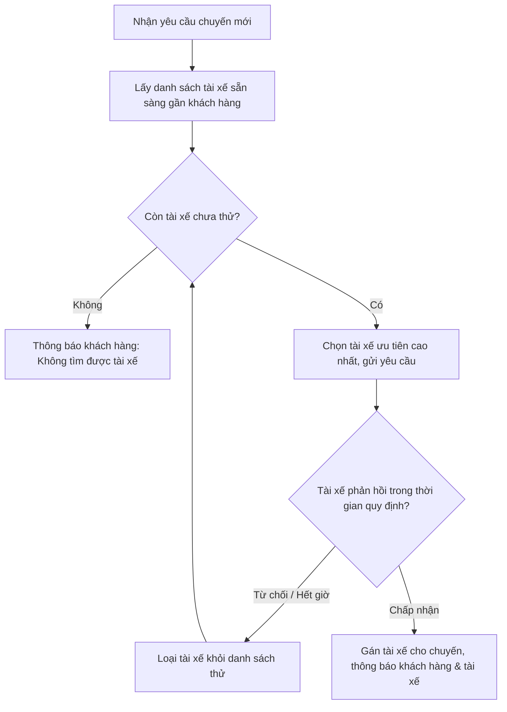
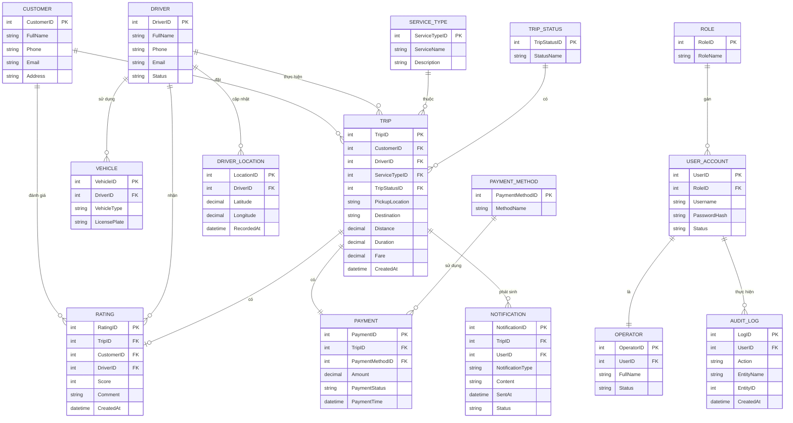
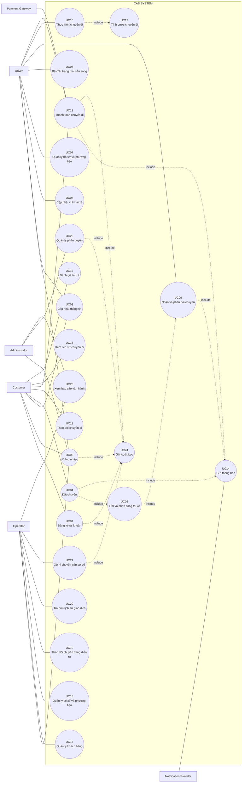

## Dự án: CAB System – Nền tảng đặt xe (Công ty ABC)
**Thời gian triển khai:** 7 tuần

---

## 1. Business Context & Vấn đề nghiệp vụ (Business Context)

### 1.1 Bối cảnh hiện tại
Công ty ABC hiện vận hành dịch vụ đặt xe trực tuyến qua hai kênh chính: tổng đài điện thoại và một ứng dụng đơn giản. Đây là mô hình vận hành ở giai đoạn đầu, chưa được số hóa và tự động hóa đầy đủ.

### 1.2 Vấn đề nghiệp vụ (Problem Statement)

| # | Vấn đề | Ảnh hưởng |
|---|---|---|
| P1 | Phân công tài xế chủ yếu thủ công | Chậm, dễ sai sót, không tối ưu khi số lượng chuyến tăng |
| P2 | Khách hàng khó theo dõi trạng thái chuyến đi | Trải nghiệm kém, tăng cuộc gọi hỗ trợ đến tổng đài |
| P3 | Thông tin thanh toán chưa tập trung | Khó đối soát, khó kiểm soát doanh thu, khó mở rộng phương thức thanh toán |
| P4 | Hệ thống hiện tại khó mở rộng | Không đáp ứng được khi lượng khách hàng/tài xế tăng, khó thêm tính năng mới |

### 1.3 Động lực thay đổi (Business Drivers)
- Ban lãnh đạo muốn phục vụ **số lượng lớn** khách hàng và tài xế.
- Cần nền tảng có khả năng **mở rộng tính năng trong tương lai** (dịch vụ mới, phương thức thanh toán mới, kênh thông báo mới) mà không phải xây lại toàn bộ hệ thống.
- Thời hạn triển khai gấp (**7 tuần**) → cần xác định rõ phạm vi MVP (Minimum Viable Product) khả thi.

### 1.4 Trạng thái mong muốn (Desired Future State)
Một nền tảng CAB tự động hóa việc tìm và phân công tài xế, cho khách hàng theo dõi chuyến đi theo thời gian thực, quản lý thanh toán tập trung (tiền mặt + điện tử qua đối tác ngoài), có hệ thống thông báo đa kênh, giao diện quản trị cho vận hành, và kiến trúc linh hoạt để mở rộng lâu dài — **không chỉ là một app đặt xe đơn thuần**.

---

## 2. Stakeholders

### 2.1 Bảng Stakeholders

| Tên Stakeholder | Vai trò |
|---|---|
| Ban lãnh đạo / Ban giám đốc Công ty ABC | Người ra quyết định, phê duyệt ngân sách, định hướng chiến lược; kỳ vọng hệ thống mở rộng được và có báo cáo vận hành |
| Khách hàng (Customer) | Người dùng cuối đặt xe; đăng ký tài khoản, tạo yêu cầu chuyến đi, theo dõi trạng thái, thanh toán, đánh giá tài xế |
| Tài xế (Driver) | Người cung cấp dịch vụ vận chuyển; nhận/từ chối chuyến, cập nhật trạng thái và vị trí |
| Nhân viên vận hành (Operations Staff) | Quản trị hàng ngày: khách hàng, tài xế, phương tiện, chuyến đi; xử lý sự cố |
| Business Analyst (BA) | Làm rõ yêu cầu, phạm vi, quy trình nghiệp vụ, quy tắc nghiệp vụ với các bên liên quan |
| Nhóm phát triển (Development Team) | Xây dựng, kiểm thử, triển khai hệ thống theo yêu cầu đã phân tích |
| Nhà cung cấp thanh toán bên ngoài (Payment Gateway Provider) | Đối tác xử lý giao dịch điện tử; đảm bảo dữ liệu nhạy cảm không lưu trong hệ thống CAB |
| Nhà cung cấp dịch vụ thông báo (Notification Provider) | Đối tác/kênh gửi thông báo (hiện tại và mở rộng tương lai) |

### 2.2 Ma trận Stakeholder (Power/Interest Matrix)



### 2.3 Diễn giải 4 vùng

| Vùng | Ý nghĩa | Stakeholder | Chiến lược quản lý |
|---|---|---|---|
| Manage Closely | Power cao, Interest cao | Ban lãnh đạo, Nhân viên vận hành, BA, Nhóm phát triển | Tham vấn thường xuyên, báo cáo tiến độ định kỳ |
| Keep Satisfied | Power cao, Interest thấp–trung bình | Nhà cung cấp thanh toán | Đảm bảo tích hợp ổn định, thông báo khi có thay đổi hợp đồng/API |
| Keep Informed | Power thấp, Interest cao | Khách hàng, Tài xế | Thu thập phản hồi, thông báo minh bạch về thay đổi |
| Monitor | Power thấp, Interest thấp | Nhà cung cấp thông báo | Theo dõi định kỳ, ưu tiên thấp ở giai đoạn đầu |

---

## 3. Business Goals (Mục tiêu nghiệp vụ)

**Business Goal (BG)** là mục tiêu ở tầm doanh nghiệp mà hệ thống cần đạt được — trả lời câu hỏi *"Vì sao doanh nghiệp đầu tư xây dựng hệ thống này?"*. Mỗi BG nên gắn với một vấn đề đã nêu ở mục 1.2, và sau này sẽ được cụ thể hóa thành **yêu cầu chức năng (functional requirements)**.

Quy ước đặt tên: **BG + số thứ tự 2 chữ số** (BG01, BG02, …).

| Mã | Business Goal | Giải quyết vấn đề | Ghi chú |
|---|---|---|---|
| **BG01** | Tự động hóa việc tìm và phân công tài xế phù hợp dựa trên vị trí và trạng thái sẵn sàng, có cơ chế tìm tài xế thay thế khi bị từ chối/không phản hồi | P1 | Cần làm rõ tiêu chí ưu tiên và thời gian chờ phản hồi (đang mở) |
| **BG02** | Cho phép khách hàng thanh toán bằng tiền mặt hoặc thanh toán trực tuyến thông qua đối tác thanh toán bên ngoài, không lưu dữ liệu nhạy cảm trong hệ thống CAB | P3 | Cần làm rõ chính sách xử lý khi giao dịch điện tử thất bại |
| **BG03** | Cho phép khách hàng theo dõi trạng thái chuyến đi theo thời gian thực (đang tìm tài xế → đã nhận chuyến → đến điểm đón → đang di chuyển → hoàn thành) | P2 | Gắn với yêu cầu thông báo đa kênh |
| **BG04** | Xây dựng kiến trúc hệ thống có khả năng mở rộng độc lập theo từng thành phần, chịu tải tốt ở giờ cao điểm, lỗi ở một phân hệ (thanh toán/thông báo) không làm sập toàn hệ thống | P4 | Yêu cầu phi chức năng (NFR) về scalability & resilience |
| **BG05** | Cho phép bổ sung loại dịch vụ mới, phương thức thanh toán mới, kênh thông báo mới trong tương lai mà không xây lại toàn bộ ứng dụng | P4 | Yêu cầu về tính mở rộng/linh hoạt của kiến trúc |
| **BG06** | Cung cấp giao diện quản trị cho nhân viên vận hành để quản lý khách hàng, tài xế, phương tiện, chuyến đi, có phân quyền cho thao tác nhạy cảm | P1, P3 | Gắn với yêu cầu bảo mật, kiểm soát truy cập |
| **BG07** | Cung cấp báo cáo vận hành cho ban lãnh đạo: số lượng chuyến, doanh thu, tỷ lệ hoàn thành, tỷ lệ hủy, hiệu quả tài xế | — | Hỗ trợ ra quyết định chiến lược |
| **BG08** | Đảm bảo xác thực người dùng, kiểm soát quyền truy cập và lưu vết (audit log) các thao tác quan trọng | — | Yêu cầu phi chức năng về bảo mật |

> **Lưu ý:** BG01, BG04, BG05, BG08 mang tính kỹ thuật/vận hành nền tảng; BG02, BG03, BG06, BG07 gắn trực tiếp với trải nghiệm người dùng và giá trị kinh doanh có thể đo lường (đo bằng tỷ lệ hoàn thành chuyến, thời gian tìm tài xế trung bình, tỷ lệ giao dịch thanh toán thành công...). Nên bổ sung chỉ số đo lường cụ thể (KPI) cho từng BG sau khi làm rõ với khách hàng.

---

## 4. Xác định Phạm vi (Scope)

Với thời gian triển khai chỉ **7 tuần**, phạm vi cần được giới hạn chặt ở mức MVP — tập trung vào luồng nghiệp vụ cốt lõi, các phần chưa chốt (tính cước, tiêu chí ưu tiên tài xế, chính sách hủy chuyến...) sẽ được xử lý bằng cấu hình đơn giản/quy tắc tạm thời thay vì xây dựng đầy đủ.

### 4.1 Trong phạm vi (In-Scope)

**Khách hàng (Customer App)**
- Đăng ký / đăng nhập / cập nhật thông tin cá nhân
- Tạo yêu cầu đặt xe (điểm đón, điểm đến, loại xe)
- Theo dõi trạng thái chuyến đi theo thời gian thực
- Xem lịch sử chuyến đi, số tiền, đánh giá tài xế sau chuyến

**Tài xế (Driver App)**
- Đăng ký / được tạo tài khoản bởi vận hành
- Cập nhật hồ sơ, phương tiện, trạng thái sẵn sàng
- Nhận thông báo chuyến mới, chấp nhận/từ chối
- Cập nhật trạng thái chuyến (đến điểm đón, đón khách, di chuyển, hoàn thành)
- Gửi vị trí định kỳ

**Vận hành (Admin Portal)**
- Quản lý khách hàng, tài xế, phương tiện, chuyến đi
- Xem chuyến đang diễn ra, xử lý chuyến lỗi
- Phân quyền cơ bản (nhân viên thường vs. quản trị)
- Báo cáo cơ bản: số chuyến, doanh thu, tỷ lệ hoàn thành/hủy

**Lõi hệ thống**
- Thuật toán tìm tài xế cơ bản (theo vị trí + trạng thái sẵn sàng), có cơ chế tìm tài xế kế tiếp khi bị từ chối/không phản hồi
- Tính cước cơ bản theo loại dịch vụ (công thức đơn giản, có thể cấu hình)
- Thanh toán: tiền mặt + tích hợp 1 đối tác thanh toán điện tử bên ngoài
- Thông báo qua tối thiểu 1 kênh (ví dụ push notification/app), thiết kế cho phép bổ sung kênh sau
- Xác thực người dùng, kiểm soát truy cập cơ bản, audit log cho thao tác quan trọng

### 4.2 Ngoài phạm vi (Out-of-Scope) — cho giai đoạn 7 tuần này
- Tích hợp nhiều nhà cung cấp thanh toán cùng lúc
- Đa kênh thông báo (SMS, email...) — chỉ thiết kế kiến trúc sẵn sàng mở rộng, chưa triển khai đủ trong giai đoạn 1
- Thuật toán định giá động (dynamic pricing) phức tạp
- Ứng dụng cho nhiều loại dịch vụ mới ngoài đặt xe cơ bản
- Báo cáo/phân tích nâng cao (dashboard BI chuyên sâu)
- Xử lý chi tiết các tình huống mất kết nối mạng kéo dài (chỉ xử lý ở mức cơ bản)
- Chính sách hủy chuyến chi tiết theo nhiều kịch bản (áp dụng chính sách tạm thời đơn giản)

### 4.3 Các điểm còn mở — cần làm rõ với khách hàng trước khi thiết kế chi tiết
| # | Vấn đề cần làm rõ | Ảnh hưởng nếu chưa rõ |
|---|---|---|
| 1 | Công thức tính cước chính xác | Ảnh hưởng trực tiếp BG02, thiết kế module fare |
| 2 | Tiêu chí ưu tiên tài xế (khoảng cách, đánh giá, thời gian chờ...) | Ảnh hưởng thuật toán matching (BG01) |
| 3 | Thời gian tài xế phải phản hồi trước khi hệ thống chuyển sang tài xế khác | Ảnh hưởng UX và thiết kế timeout |
| 4 | Chính sách hủy chuyến (ai được hủy, phí hủy, thời điểm) | Ảnh hưởng luồng nghiệp vụ trip lifecycle |
| 5 | Cách xử lý khi mất kết nối mạng (khách hàng/tài xế) | Ảnh hưởng thiết kế resilience, đồng bộ trạng thái |
| 6 | Thời gian lưu trữ dữ liệu (retention policy) | Ảnh hưởng thiết kế dữ liệu, tuân thủ pháp lý |

> Đây là các câu hỏi BA cần đưa vào phiên **elicitation** tiếp theo với Ban lãnh đạo / Nhân viên vận hành trước khi chốt SRS chi tiết.
## 5. Business Requirements (BR)

**Business Requirement (BR)** mô tả **hệ thống cần làm gì** ở mức nghiệp vụ để đạt được các Business Goal ở mục 3 — chi tiết hơn BG nhưng chưa đi sâu vào giao diện/kỹ thuật (đó là việc của Functional Requirements ở bước sau).

Quy ước đặt tên: **BR + số thứ tự 2 chữ số** (BR01, BR02, …).

| Mã | Tên | Diễn giải |
|---|---|---|
| **BR01** | Đăng ký & Đăng nhập tài khoản | Hệ thống cho phép khách hàng và tài xế tạo tài khoản, xác thực khi đăng nhập, và cập nhật thông tin cá nhân cơ bản. Tài xế có thể được nhân viên vận hành tạo tài khoản thay vì tự đăng ký. |
| **BR02** | Đặt Chuyến | Hệ thống cho phép khách hàng nhập điểm đón, điểm đến, chọn loại xe và gửi yêu cầu đặt chuyến. Yêu cầu sau khi gửi sẽ được chuyển sang quy trình tìm tài xế. |
| **BR03** | Tìm & Phân công Tài xế | Hệ thống tự động xác định tài xế phù hợp dựa trên vị trí, trạng thái sẵn sàng và tiêu chí vận hành; nếu tài xế được đề xuất không phản hồi hoặc từ chối, hệ thống tự động tìm tài xế kế tiếp mà không yêu cầu khách hàng tạo lại yêu cầu. Nếu không tìm được tài xế, khách hàng được thông báo rõ ràng. |
| **BR04** | Quản lý Hồ sơ & Trạng thái Tài xế | Hệ thống cho phép tài xế cập nhật hồ sơ cá nhân, thông tin phương tiện và chuyển đổi trạng thái hoạt động (sẵn sàng/không sẵn sàng nhận chuyến). |
| **BR05** | Phản hồi Yêu cầu Chuyến | Hệ thống gửi thông báo chuyến mới cho tài xế phù hợp và cho phép tài xế chấp nhận hoặc từ chối trong một khoảng thời gian quy định. |
| **BR06** | Theo dõi & Cập nhật Trạng thái Chuyến đi | Hệ thống cho phép tài xế cập nhật các mốc trạng thái chuyến (đã đến điểm đón, đã đón khách, đang di chuyển, hoàn thành chuyến) và cho phép khách hàng theo dõi các mốc này theo thời gian thực, bao gồm cả thời gian dự kiến tài xế đến. |
| **BR07** | Ghi nhận Vị trí Tài xế | Hệ thống lưu và cập nhật vị trí tài xế theo thời gian để phục vụ việc tìm tài xế gần khách hàng và cải thiện độ chính xác của thời gian dự kiến đến. |
| **BR08** | Tính Cước Chuyến đi | Sau khi chuyến hoàn thành, hệ thống xác định số tiền khách hàng phải trả dựa trên loại dịch vụ và thông tin chuyến đi (quãng đường, thời gian…). |
| **BR09** | Thanh toán Chuyến đi | Hệ thống cho phép khách hàng thanh toán bằng tiền mặt hoặc thanh toán điện tử thông qua đối tác thanh toán bên ngoài; dữ liệu thẻ/tài khoản thanh toán nhạy cảm không được lưu trực tiếp trong hệ thống CAB. Nếu giao dịch điện tử thất bại, hệ thống thông báo cho khách hàng và cho phép xử lý lại theo chính sách quy định. |
| **BR10** | Gửi Thông báo | Hệ thống gửi thông báo cho khách hàng (khi yêu cầu được tiếp nhận, khi có tài xế nhận chuyến, khi tài xế đến điểm đón, khi chuyến hoàn thành, khi thanh toán có kết quả) và cho tài xế (khi có chuyến mới hoặc thay đổi liên quan đến chuyến đang thực hiện), với kiến trúc cho phép mở rộng thêm kênh thông báo trong tương lai. |
| **BR11** | Xem Lịch sử & Đánh giá Chuyến đi | Hệ thống cho phép khách hàng xem lại lịch sử các chuyến đã thực hiện, số tiền đã thanh toán, và đánh giá tài xế sau khi hoàn thành chuyến. |
| **BR12** | Quản trị Khách hàng, Tài xế, Phương tiện, Chuyến đi | Hệ thống cung cấp giao diện cho nhân viên vận hành quản lý thông tin khách hàng, tài xế, phương tiện; xem các chuyến đang diễn ra, kiểm tra trạng thái tài xế và tra cứu lịch sử giao dịch. |
| **BR13** | Xử lý Sự cố Chuyến đi | Hệ thống hỗ trợ nhân viên vận hành can thiệp, xử lý các chuyến gặp lỗi hoặc phát sinh bất thường trong quá trình thực hiện. |
| **BR14** | Phân quyền Chức năng Quản trị | Hệ thống phân quyền các chức năng quản trị theo vai trò, đảm bảo nhân viên vận hành thông thường không thể thực hiện các thao tác nhạy cảm dành cho quản trị viên. |
| **BR15** | Báo cáo Vận hành | Hệ thống cung cấp báo cáo cho ban lãnh đạo về số lượng chuyến, doanh thu, tỷ lệ chuyến hoàn thành, tỷ lệ hủy và hiệu quả hoạt động của tài xế. |
| **BR16** | Xác thực & Kiểm soát Truy cập | Hệ thống yêu cầu khách hàng và tài xế xác thực trước khi sử dụng các chức năng cần tài khoản; các thao tác quản trị phải được kiểm soát quyền truy cập tương ứng. |
| **BR17** | Lưu vết Thao tác (Audit Log) | Hệ thống ghi lại (log) các thao tác quan trọng liên quan đến tài khoản, chuyến đi, thanh toán và quản trị để phục vụ kiểm tra khi có sự cố. |

### Bảng ánh xạ BR → BG

| BR | Thuộc Business Goal |
|---|---|
| BR01, BR16 | BG08 |
| BR02 | BG01, BG03 |
| BR03, BR05 | BG01 |
| BR04, BR07 | BG01 |
| BR06 | BG03 |
| BR08, BR09 | BG02 |
| BR10 | BG03, BG05 |
| BR11 | BG03 |
| BR12, BR13, BR14 | BG06 |
| BR15 | BG07 |
| BR17 | BG08 |
## 6. Business Process (Quy trình nghiệp vụ)

Mục này mô tả **luồng nghiệp vụ end-to-end** cho quy trình cốt lõi nhất của hệ thống — **Đặt Chuyến** — từ lúc khách hàng khởi tạo yêu cầu đến khi hoàn tất thanh toán và đánh giá. Sơ đồ dùng dạng **swimlane** (3 làn: Khách hàng / Hệ thống / Tài xế) để thấy rõ trách nhiệm từng actor, khớp với các BR đã định nghĩa ở mục 5.

### 6.1 Sơ đồ tổng quan (Swimlane Flowchart)



### 6.2 Chi tiết các bước – Quy trình Đặt Chuyến

| Bước | Actor | Mô tả | BR liên quan |
|---|---|---|---|
| 1 | Khách hàng | Mở ứng dụng, chọn chức năng đặt chuyến | BR02 |
| 2 | Khách hàng | Nhập điểm đón, điểm đến | BR02 |
| 3 | Khách hàng | Chọn loại xe / dịch vụ mong muốn | BR02 |
| 4 | Khách hàng | Xác nhận gửi yêu cầu đặt chuyến | BR02 |
| 5 | Hệ thống | Xác nhận yêu cầu hợp lệ, tạo bản ghi chuyến với trạng thái "Đang tìm tài xế" | BR02, BR10 |
| 6 | Hệ thống | Xác định danh sách tài xế phù hợp theo vị trí, trạng thái sẵn sàng | BR03, BR07 |
| 7 | Hệ thống | Gửi yêu cầu chuyến cho tài xế ưu tiên nhất | BR03, BR05 |
| 8 | Tài xế | Nhận thông báo chuyến mới, chấp nhận hoặc từ chối | BR05, BR10 |
| 9a | Hệ thống | Nếu tài xế từ chối/không phản hồi trong thời gian quy định → quay lại bước 6, tìm tài xế kế tiếp | BR03 |
| 9b | Hệ thống | Nếu không còn tài xế phù hợp → thông báo khách hàng không tìm được tài xế, kết thúc quy trình | BR03, BR10 |
| 10 | Hệ thống | Nếu tài xế chấp nhận → cập nhật trạng thái "Đã có tài xế", thông báo cả hai bên | BR06, BR10 |
| 11 | Tài xế | Di chuyển đến điểm đón, cập nhật trạng thái "Đã đến điểm đón" | BR06 |
| 12 | Tài xế | Đón khách, cập nhật trạng thái "Đang di chuyển" | BR06 |
| 13 | Tài xế | Đến điểm đến, cập nhật trạng thái "Hoàn thành chuyến" | BR06 |
| 14 | Hệ thống | Tính cước chuyến đi dựa trên loại dịch vụ và thông tin chuyến | BR08 |
| 15 | Khách hàng / Hệ thống | Xác định phương thức thanh toán: tiền mặt hoặc điện tử | BR09 |
| 16a | Hệ thống | Nếu điện tử → gọi đối tác thanh toán; thất bại thì thông báo lỗi và cho thử lại | BR09 |
| 16b | Tài xế | Nếu tiền mặt → xác nhận đã nhận tiền | BR09 |
| 17 | Hệ thống | Ghi nhận kết quả thanh toán, lưu lịch sử chuyến, thông báo hoàn tất | BR09, BR10, BR11 |
| 18 | Khách hàng | Đánh giá tài xế sau chuyến (tùy chọn) | BR11 |

### 6.3 Quy trình phụ – Tìm & Phân công Tài xế (chi tiết vòng lặp)

Đây là quy trình con quan trọng nhất vì có tính lặp (retry) — cần làm rõ với khách hàng về **tiêu chí ưu tiên** và **thời gian chờ phản hồi** (xem mục 4.3):



### 6.4 Ghi chú
- Quy trình trên là **thiết kế mức nghiệp vụ** dựa trên yêu cầu đã có; các thông số cụ thể (thời gian timeout ở bước 9a, công thức tính cước ở bước 14, chính sách thử lại thanh toán ở bước 16a) vẫn là **điểm mở** cần chốt với khách hàng (mục 4.3) trước khi chuyển sang thiết kế chi tiết / Functional Requirements.
- Có thể bổ sung thêm quy trình phụ khác nếu cần: **Quy trình Hủy chuyến**, **Quy trình Xử lý sự cố (Admin can thiệp)** — đề xuất làm sau khi chính sách hủy chuyến được xác nhận.
## 7. Functional Requirements (FR)

**Functional Requirement (FR)** là yêu cầu ở mức **chức năng cụ thể mà hệ thống phải thực hiện được** — được phân rã (decompose) từ Business Requirements ở mục 5. Nếu BR trả lời "hệ thống cần làm được việc gì ở tầm nghiệp vụ", thì FR trả lời **"hệ thống thực hiện việc đó bằng những chức năng cụ thể nào"** — đủ chi tiết để đội phát triển thiết kế màn hình, API, luồng xử lý.

Quy ước đặt tên: **FR + số thứ tự 2 chữ số** (FR01, FR02, …). Mỗi FR được map ngược lại một BR để đảm bảo **truy vết được (traceability)**: BG → BR → FR.

### 7.1 Nhóm Tài khoản & Xác thực (từ BR01, BR16)

| Mã | Tên | Diễn giải | BR |
|---|---|---|---|
| **FR01** | Đăng ký tài khoản khách hàng | Hệ thống cho phép người dùng mới tạo tài khoản khách hàng bằng thông tin cơ bản (họ tên, số điện thoại/email, mật khẩu) | BR01 |
| **FR02** | Khởi tạo tài khoản tài xế | Hệ thống cho phép tài xế tự đăng ký hoặc nhân viên vận hành tạo tài khoản thay tài xế | BR01 |
| **FR03** | Đăng nhập hệ thống | Hệ thống xác thực thông tin đăng nhập trước khi cấp quyền truy cập chức năng | BR01, BR16 |
| **FR04** | Cập nhật thông tin cá nhân | Cho phép khách hàng/tài xế chỉnh sửa thông tin hồ sơ cá nhân đã đăng ký | BR01 |
| **FR05** | Xác thực trước khi dùng chức năng cần tài khoản | Hệ thống chặn truy cập các chức năng yêu cầu đăng nhập nếu người dùng chưa xác thực | BR16 |

### 7.2 Nhóm Đặt Chuyến (từ BR02)

| Mã | Tên | Diễn giải | BR |
|---|---|---|---|
| **FR06** | Nhập điểm đón & điểm đến | Cho phép khách hàng nhập hoặc chọn điểm đón, điểm đến trên bản đồ | BR02 |
| **FR07** | Chọn loại xe/dịch vụ | Cho phép khách hàng chọn loại dịch vụ mong muốn trước khi gửi yêu cầu | BR02 |
| **FR08** | Gửi yêu cầu đặt chuyến | Hệ thống tiếp nhận, xác nhận yêu cầu hợp lệ và khởi tạo bản ghi chuyến với trạng thái "Đang tìm tài xế" | BR02 |

### 7.3 Nhóm Tìm & Phân công Tài xế (từ BR03, BR07)

| Mã | Tên | Diễn giải | BR |
|---|---|---|---|
| **FR09** | Xác định danh sách tài xế phù hợp | Hệ thống lọc tài xế theo vị trí gần nhất và trạng thái sẵn sàng | BR03 |
| **FR10** | Gửi yêu cầu chuyến cho tài xế theo thứ tự ưu tiên | Hệ thống gửi yêu cầu tuần tự cho từng tài xế theo tiêu chí ưu tiên | BR03 |
| **FR11** | Xử lý từ chối/hết thời gian phản hồi | Khi tài xế từ chối hoặc không phản hồi trong thời gian quy định, hệ thống tự động chuyển sang tài xế kế tiếp | BR03 |
| **FR12** | Thông báo không tìm được tài xế | Khi không còn tài xế phù hợp, hệ thống thông báo rõ ràng cho khách hàng | BR03 |
| **FR13** | Ghi nhận & cập nhật vị trí tài xế | Hệ thống lưu vị trí tài xế định kỳ để phục vụ việc tìm tài xế gần khách hàng | BR07 |

### 7.4 Nhóm Hồ sơ & Trạng thái Tài xế (từ BR04, BR05)

| Mã | Tên | Diễn giải | BR |
|---|---|---|---|
| **FR14** | Cập nhật hồ sơ & phương tiện tài xế | Cho phép tài xế cập nhật thông tin cá nhân và thông tin phương tiện | BR04 |
| **FR15** | Chuyển đổi trạng thái sẵn sàng | Cho phép tài xế bật/tắt trạng thái sẵn sàng nhận chuyến | BR04 |
| **FR16** | Nhận thông báo chuyến mới | Hệ thống gửi thông báo chuyến mới đến tài xế được chọn | BR05 |
| **FR17** | Chấp nhận/từ chối chuyến | Cho phép tài xế phản hồi chấp nhận hoặc từ chối yêu cầu chuyến | BR05 |

### 7.5 Nhóm Thực hiện Chuyến đi (từ BR06)

| Mã | Tên | Diễn giải | BR |
|---|---|---|---|
| **FR18** | Cập nhật trạng thái chuyến (tài xế) | Cho phép tài xế cập nhật các mốc: đã đến điểm đón, đã đón khách, đang di chuyển, hoàn thành chuyến | BR06 |
| **FR19** | Theo dõi trạng thái chuyến theo thời gian thực (khách hàng) | Hệ thống hiển thị trạng thái chuyến cập nhật liên tục cho khách hàng | BR06 |
| **FR20** | Ước tính thời gian tài xế đến (ETA) | Hệ thống tính và hiển thị thời gian dự kiến tài xế đến điểm đón | BR06 |

### 7.6 Nhóm Tính Cước & Thanh toán (từ BR08, BR09)

| Mã | Tên | Diễn giải | BR |
|---|---|---|---|
| **FR21** | Tính cước chuyến đi tự động | Hệ thống tính số tiền phải trả dựa trên loại dịch vụ và thông tin chuyến khi chuyến hoàn thành | BR08 |
| **FR22** | Chọn phương thức thanh toán | Cho phép khách hàng chọn thanh toán tiền mặt hoặc điện tử | BR09 |
| **FR23** | Xử lý thanh toán tiền mặt | Cho phép tài xế xác nhận đã nhận tiền mặt từ khách hàng | BR09 |
| **FR24** | Xử lý thanh toán điện tử | Hệ thống gọi API đối tác thanh toán để xử lý giao dịch, không lưu dữ liệu nhạy cảm | BR09 |
| **FR25** | Xử lý giao dịch thanh toán thất bại | Khi giao dịch điện tử thất bại, hệ thống thông báo và cho phép khách hàng thử lại | BR09 |

### 7.7 Nhóm Thông báo (từ BR10)

| Mã | Tên | Diễn giải | BR |
|---|---|---|---|
| **FR26** | Gửi thông báo cho khách hàng | Hệ thống gửi thông báo tại các mốc: tiếp nhận yêu cầu, có tài xế, tài xế đến, hoàn thành chuyến, kết quả thanh toán | BR10 |
| **FR27** | Gửi thông báo cho tài xế | Hệ thống gửi thông báo về chuyến mới hoặc thay đổi liên quan đến chuyến đang thực hiện | BR10 |
| **FR28** | Kiến trúc thông báo mở rộng được | Thiết kế cho phép bổ sung kênh thông báo mới (SMS, email...) mà không thay đổi toàn bộ hệ thống | BR10 |

### 7.8 Nhóm Lịch sử & Đánh giá (từ BR11)

| Mã | Tên | Diễn giải | BR |
|---|---|---|---|
| **FR29** | Xem lịch sử chuyến đi | Cho phép khách hàng xem lại danh sách các chuyến đã thực hiện kèm số tiền đã thanh toán | BR11 |
| **FR30** | Đánh giá tài xế | Cho phép khách hàng đánh giá tài xế sau khi chuyến hoàn thành | BR11 |

### 7.9 Nhóm Quản trị Vận hành (từ BR12, BR13, BR14)

| Mã | Tên | Diễn giải | BR |
|---|---|---|---|
| **FR31** | Quản lý thông tin khách hàng | Cho phép nhân viên vận hành xem/chỉnh sửa thông tin khách hàng | BR12 |
| **FR32** | Quản lý thông tin tài xế & phương tiện | Cho phép nhân viên vận hành xem/chỉnh sửa thông tin tài xế và phương tiện | BR12 |
| **FR33** | Xem danh sách chuyến đang diễn ra | Hiển thị các chuyến đang thực hiện theo thời gian thực cho nhân viên vận hành | BR12 |
| **FR34** | Tra cứu lịch sử giao dịch | Cho phép nhân viên vận hành tìm kiếm và xem lịch sử chuyến/giao dịch | BR12 |
| **FR35** | Xử lý chuyến gặp sự cố | Cho phép nhân viên vận hành can thiệp vào chuyến bị lỗi hoặc bất thường | BR13 |
| **FR36** | Phân quyền chức năng quản trị | Hệ thống giới hạn các thao tác nhạy cảm chỉ dành cho tài khoản có quyền phù hợp | BR14 |

### 7.10 Nhóm Báo cáo (từ BR15)

| Mã | Tên | Diễn giải | BR |
|---|---|---|---|
| **FR37** | Báo cáo số lượng chuyến & doanh thu | Hệ thống tổng hợp và hiển thị số chuyến, doanh thu theo khoảng thời gian | BR15 |
| **FR38** | Báo cáo tỷ lệ hoàn thành/hủy chuyến | Hệ thống tính và hiển thị tỷ lệ chuyến hoàn thành và tỷ lệ hủy | BR15 |
| **FR39** | Báo cáo hiệu quả hoạt động tài xế | Hệ thống tổng hợp số liệu hiệu quả theo từng tài xế | BR15 |

### 7.11 Nhóm Bảo mật & Audit (từ BR16, BR17)

| Mã | Tên | Diễn giải | BR |
|---|---|---|---|
| **FR40** | Kiểm soát quyền truy cập theo vai trò | Hệ thống giới hạn chức năng hiển thị/thao tác theo vai trò người dùng | BR16 |
| **FR41** | Ghi vết thao tác (Audit Log) | Hệ thống ghi lại thời gian, người thực hiện và nội dung của các thao tác quan trọng | BR17 |

### 7.12 Bảng truy vết tổng hợp (Traceability Matrix rút gọn)

| Business Goal (BG) | Business Requirement (BR) | Số lượng FR phân rã |
|---|---|---|
| BG01 | BR02, BR03, BR04, BR05, BR07 | FR06–FR17 (12 FR) |
| BG02 | BR08, BR09 | FR21–FR25 (5 FR) |
| BG03 | BR02, BR06, BR10, BR11 | FR06, FR08, FR18–FR20, FR26–FR30 |
| BG05 | BR10 | FR28 |
| BG06 | BR12, BR13, BR14 | FR31–FR36 (6 FR) |
| BG07 | BR15 | FR37–FR39 (3 FR) |
| BG08 | BR01, BR16, BR17 | FR01–FR05, FR40–FR41 |

> **Lưu ý:** Một số FR (FR09–FR11 về tiêu chí/timeout tìm tài xế; FR21 về công thức tính cước; FR25 về chính sách thử lại thanh toán) **chưa thể hoàn thiện đặc tả chi tiết (spec)** cho đến khi các điểm mở ở mục 4.3 được khách hàng xác nhận. Đây sẽ là input bắt buộc trước khi viết **Đặc tả yêu cầu phần mềm (SRS)** hoặc User Story chi tiết ở bước sau.
## 8. Business Rules & Exceptions

### 8.1 Business Rules

| Mã | Business Rule | Mô tả |
|---|---|---|
| **BRULE01** | Quy tắc đặt chuyến | Khách hàng phải nhập đầy đủ điểm đón, điểm đến và loại xe/dịch vụ trước khi gửi yêu cầu đặt chuyến. |
| **BRULE02** | Quy tắc tìm tài xế | Hệ thống chỉ lựa chọn tài xế đang ở trạng thái **sẵn sàng nhận chuyến** và phù hợp với vị trí của khách hàng. |
| **BRULE03** | Quy tắc phân công tài xế | Hệ thống gửi yêu cầu lần lượt cho tài xế theo thứ tự ưu tiên. Nếu tài xế từ chối hoặc không phản hồi trong thời gian quy định thì chuyển sang tài xế tiếp theo. |
| **BRULE04** | Quy tắc nhận chuyến | Khi tài xế chấp nhận chuyến, hệ thống cập nhật trạng thái chuyến thành **"Đã có tài xế"** và thông báo cho khách hàng. |
| **BRULE05** | Quy tắc trạng thái chuyến | Trạng thái chuyến phải được cập nhật theo trình tự: **Đang tìm tài xế → Đã có tài xế → Đã đến điểm đón → Đang di chuyển → Hoàn thành**. |
| **BRULE06** | Quy tắc tính cước | Cước chuyến được tính sau khi chuyến hoàn thành dựa trên loại dịch vụ và thông tin chuyến đi như quãng đường, thời gian. |
| **BRULE07** | Quy tắc thanh toán | Khách hàng được thanh toán bằng **tiền mặt hoặc thanh toán điện tử** thông qua đối tác thanh toán bên ngoài. |
| **BRULE08** | Bảo mật thanh toán | Hệ thống CAB **không được lưu trực tiếp dữ liệu thẻ/tài khoản thanh toán nhạy cảm** của khách hàng. |
| **BRULE09** | Quy tắc thanh toán tiền mặt | Khi khách hàng thanh toán tiền mặt, tài xế phải xác nhận đã nhận tiền. |
| **BRULE10** | Quy tắc thanh toán điện tử | Khi thanh toán điện tử thất bại, hệ thống phải thông báo cho khách hàng và cho phép xử lý/thử lại theo chính sách được quy định. |
| **BRULE11** | Quy tắc đánh giá | Khách hàng chỉ được đánh giá tài xế sau khi chuyến đi đã hoàn thành. |
| **BRULE12** | Quy tắc phân quyền | Nhân viên vận hành thông thường không được thực hiện các thao tác nhạy cảm chỉ dành cho quản trị viên. |
| **BRULE13** | Quy tắc Audit Log | Các thao tác quan trọng liên quan đến tài khoản, chuyến đi, thanh toán và quản trị phải được ghi lại để phục vụ kiểm tra. |
| **BRULE14** | Quy tắc thông báo | Hệ thống phải thông báo cho khách hàng/tài xế tại các sự kiện quan trọng của chuyến đi. |

### 8.2 Exceptions

| Mã | Exception | Điều kiện xảy ra | Cách hệ thống xử lý |
|---|---|---|---|
| **EX01** | Không tìm được tài xế | Không còn tài xế phù hợp | Thông báo cho khách hàng rằng không tìm được tài xế và kết thúc yêu cầu. |
| **EX02** | Tài xế từ chối chuyến | Tài xế chọn từ chối | Hệ thống tự động tìm và gửi yêu cầu cho tài xế tiếp theo. |
| **EX03** | Tài xế không phản hồi | Tài xế không phản hồi trong thời gian quy định | Hệ thống timeout và chuyển sang tài xế tiếp theo. |
| **EX04** | Thanh toán điện tử thất bại | Đối tác thanh toán trả về kết quả thất bại | Thông báo lỗi cho khách hàng và cho phép thử lại theo chính sách. |
| **EX05** | Mất kết nối mạng | Khách hàng hoặc tài xế mất kết nối | Hệ thống xử lý ở mức cơ bản và đồng bộ lại trạng thái khi kết nối được khôi phục. |
| **EX06** | Chuyến đi phát sinh lỗi | Chuyến có trạng thái bất thường hoặc lỗi | Nhân viên vận hành có quyền can thiệp và xử lý chuyến. |
| **EX07** | Truy cập trái phép | Người dùng cố truy cập chức năng không thuộc quyền | Hệ thống từ chối truy cập và ghi nhận thao tác vào Audit Log. |
| **EX08** | Không có tài xế sẵn sàng | Tại thời điểm đặt chuyến không có tài xế ở trạng thái sẵn sàng | Thông báo khách hàng không tìm được tài xế. |
| **EX09** | Thông báo không gửi được | Kênh thông báo gặp lỗi | Hệ thống ghi nhận lỗi và không làm ảnh hưởng đến luồng chính của chuyến đi. |

### 8.3 Các Business Rule cần làm rõ

Một số quy tắc hiện chưa thể xác định giá trị cụ thể và cần xác nhận với khách hàng:

| # | Nội dung cần làm rõ | Ảnh hưởng |
|---|---|---|
| **1** | Tiêu chí ưu tiên tài xế: khoảng cách, đánh giá, thời gian chờ,... | Ảnh hưởng thuật toán tìm và phân công tài xế |
| **2** | Thời gian tài xế phải phản hồi trước khi chuyển sang tài xế khác | Ảnh hưởng cơ chế timeout và trải nghiệm người dùng |
| **3** | Công thức tính cước chính xác | Ảnh hưởng chức năng tính cước |
| **4** | Chính sách xử lý khi thanh toán điện tử thất bại | Ảnh hưởng quy trình thanh toán |
| **5** | Chính sách hủy chuyến | Ảnh hưởng vòng đời của chuyến đi |
| **6** | Cách xử lý khi mất kết nối mạng kéo dài | Ảnh hưởng khả năng đồng bộ và phục hồi trạng thái |

> **Lưu ý:** Các nội dung trên đang là những điểm mở trong yêu cầu nghiệp vụ, cần được BA xác nhận với khách hàng trước khi đặc tả chi tiết.
# 9. Data Modeling

## 9.1 Xác định các thực thể

Dựa trên các yêu cầu nghiệp vụ và quy trình đặt chuyến, hệ thống CAB System có các thực thể chính sau:

| STT | Thực thể | Mô tả |
|---|---|---|
| 1 | **Customer** | Lưu thông tin khách hàng sử dụng dịch vụ đặt xe. |
| 2 | **Driver** | Lưu thông tin tài xế cung cấp dịch vụ vận chuyển. |
| 3 | **Vehicle** | Lưu thông tin phương tiện của tài xế. |
| 4 | **Trip** | Lưu thông tin chuyến đi được khách hàng đặt. |
| 5 | **TripStatus** | Lưu các trạng thái của chuyến đi. |
| 6 | **ServiceType** | Lưu loại xe/dịch vụ mà khách hàng lựa chọn. |
| 7 | **Payment** | Lưu thông tin và kết quả thanh toán của chuyến đi. |
| 8 | **PaymentMethod** | Lưu phương thức thanh toán: tiền mặt hoặc điện tử. |
| 9 | **DriverLocation** | Lưu vị trí của tài xế theo thời gian. |
| 10 | **Notification** | Lưu thông tin các thông báo gửi cho khách hàng và tài xế. |
| 11 | **Rating** | Lưu đánh giá của khách hàng dành cho tài xế sau chuyến đi. |
| 12 | **UserAccount** | Lưu thông tin tài khoản và thông tin xác thực người dùng. |
| 13 | **Role** | Xác định vai trò và quyền hạn của người dùng trong hệ thống. |
| 14 | **AuditLog** | Lưu vết các thao tác quan trọng trong hệ thống. |
| 15 | **Operator** | Lưu thông tin nhân viên vận hành hệ thống. |

---

## 9.2 Thuộc tính chính của các thực thể

| Thực thể | Thuộc tính chính |
|---|---|
| **Customer** | CustomerID, FullName, Phone, Email, Address |
| **Driver** | DriverID, FullName, Phone, Email, Status |
| **Vehicle** | VehicleID, DriverID, VehicleType, LicensePlate |
| **Trip** | TripID, CustomerID, DriverID, ServiceTypeID, PickupLocation, Destination, TripStatusID, Distance, Duration, Fare, CreatedAt |
| **TripStatus** | TripStatusID, StatusName |
| **ServiceType** | ServiceTypeID, ServiceName, Description |
| **Payment** | PaymentID, TripID, PaymentMethodID, Amount, PaymentStatus, PaymentTime |
| **PaymentMethod** | PaymentMethodID, MethodName |
| **DriverLocation** | LocationID, DriverID, Latitude, Longitude, RecordedAt |
| **Notification** | NotificationID, UserID, TripID, NotificationType, Content, SentAt, Status |
| **Rating** | RatingID, TripID, CustomerID, DriverID, Score, Comment, CreatedAt |
| **UserAccount** | UserID, Username, PasswordHash, RoleID, Status |
| **Role** | RoleID, RoleName |
| **AuditLog** | LogID, UserID, Action, EntityName, EntityID, CreatedAt |
| **Operator** | OperatorID, UserID, FullName, Status |

---

## 9.3 Mối quan hệ giữa các thực thể

| Quan hệ | Cardinality | Mô tả |
|---|---|---|
| Customer → Trip | 1:N | Một khách hàng có thể đặt nhiều chuyến. |
| Driver → Trip | 1:N | Một tài xế có thể thực hiện nhiều chuyến. |
| Driver → Vehicle | 1:N | Một tài xế có thể quản lý/sử dụng phương tiện. |
| ServiceType → Trip | 1:N | Một loại dịch vụ có thể được sử dụng cho nhiều chuyến. |
| Trip → TripStatus | N:1 | Một chuyến có một trạng thái hiện tại. |
| Trip → Payment | 1:1 | Một chuyến có thông tin thanh toán tương ứng. |
| PaymentMethod → Payment | 1:N | Một phương thức thanh toán có thể được sử dụng cho nhiều giao dịch. |
| Driver → DriverLocation | 1:N | Một tài xế có nhiều bản ghi vị trí theo thời gian. |
| Trip → Notification | 1:N | Một chuyến có thể phát sinh nhiều thông báo. |
| Customer → Rating | 1:N | Một khách hàng có thể tạo nhiều đánh giá. |
| Driver → Rating | 1:N | Một tài xế có thể nhận nhiều đánh giá. |
| UserAccount → Role | N:1 | Mỗi tài khoản có một vai trò. |
| UserAccount → AuditLog | 1:N | Một tài khoản có thể phát sinh nhiều bản ghi Audit Log. |
| UserAccount → Operator | 1:1 | Một tài khoản vận hành tương ứng với một nhân viên vận hành. |

---

## 9.4 Data Model – ERD


# 10. Non-Functional Requirements (NFR)

Non-Functional Requirement (NFR) mô tả các yêu cầu về **chất lượng, hiệu năng, bảo mật, khả năng mở rộng, độ tin cậy và khả năng vận hành** của hệ thống CAB System.

Khác với Functional Requirement (FR) trả lời câu hỏi **"Hệ thống phải làm gì?"**, NFR trả lời câu hỏi **"Hệ thống phải hoạt động như thế nào?"**.

Với thời gian triển khai chỉ **7 tuần**, các NFR được tập trung vào những yêu cầu quan trọng đối với MVP.

---

## 10.1 Hiệu năng – Performance

| **Mã** | **Yêu cầu** | **Tiêu chí** |
|--------|-------------|--------------|
| **NFR01** | Thời gian phản hồi API | Các API nghiệp vụ thông thường phải phản hồi trong **≤ 2 giây** với 95% request trong điều kiện tải bình thường. |
| **NFR02** | Thời gian bắt đầu tìm tài xế | Hệ thống phải bắt đầu quá trình tìm tài xế trong **≤ 3 giây** sau khi yêu cầu đặt chuyến hợp lệ được tạo. |
| **NFR03** | Cập nhật trạng thái chuyến | Trạng thái chuyến phải được cập nhật đến phía khách hàng trong thời gian gần thực, mục tiêu **≤ 3 giây** trong điều kiện mạng ổn định. |
| **NFR04** | Xử lý đồng thời | MVP phải hỗ trợ tối thiểu **100 request đồng thời** mà không làm hệ thống ngừng hoạt động. |
| **NFR05** | Truy vấn dữ liệu | Các thao tác tra cứu lịch sử chuyến, khách hàng và tài xế phải có thời gian phản hồi phù hợp khi dữ liệu tăng lên. |

> **Lưu ý:** Các giá trị định lượng trên là mức đề xuất cho MVP và cần được xác nhận lại với khách hàng trước khi chốt SRS.

---

## 10.2 Khả năng mở rộng – Scalability

| **Mã** | **Yêu cầu** | **Tiêu chí** |
|--------|-------------|--------------|
| **NFR06** | Mở rộng số lượng người dùng | Hệ thống phải có khả năng mở rộng để phục vụ số lượng khách hàng và tài xế tăng trong tương lai. |
| **NFR07** | Mở rộng loại dịch vụ | Có thể bổ sung loại dịch vụ mới mà không phải xây dựng lại toàn bộ hệ thống. |
| **NFR08** | Mở rộng phương thức thanh toán | Kiến trúc phải cho phép tích hợp thêm nhà cung cấp thanh toán mới mà không ảnh hưởng lớn đến chức năng đặt chuyến. |
| **NFR09** | Mở rộng kênh thông báo | Hệ thống phải cho phép bổ sung SMS, Email hoặc các kênh thông báo khác trong tương lai. |

**Business Goal liên quan:** BG04, BG05.

---

## 10.3 Bảo mật – Security

| **Mã** | **Yêu cầu** | **Tiêu chí** |
|--------|-------------|--------------|
| **NFR10** | Xác thực người dùng | Người dùng phải được xác thực trước khi truy cập các chức năng yêu cầu tài khoản. |
| **NFR11** | Phân quyền | Người dùng chỉ được phép truy cập các chức năng phù hợp với vai trò của mình. |
| **NFR12** | Bảo vệ mật khẩu | Mật khẩu không được lưu dưới dạng plaintext mà phải được lưu dưới dạng hash an toàn. |
| **NFR13** | Bảo vệ dữ liệu thanh toán | CAB System không được lưu trực tiếp thông tin thẻ hoặc dữ liệu thanh toán nhạy cảm. |
| **NFR14** | Bảo vệ API | Các API yêu cầu xác thực phải kiểm tra thông tin xác thực và quyền truy cập trước khi xử lý request. |
| **NFR15** | Audit Log | Các thao tác quan trọng phải được ghi nhận người thực hiện, thời gian, đối tượng và hành động. |

**Business Goal liên quan:** BG08.

---

## 10.4 Độ tin cậy – Reliability

| **Mã** | **Yêu cầu** | **Tiêu chí** |
|--------|-------------|--------------|
| **NFR16** | Bảo toàn dữ liệu chuyến | Khi xảy ra lỗi trong quá trình đặt xe, thông tin chuyến đã tạo phải được bảo toàn. |
| **NFR17** | Xử lý lỗi thanh toán | Lỗi từ Payment Gateway không được làm toàn bộ hệ thống đặt xe bị dừng. |
| **NFR18** | Xử lý lỗi thông báo | Nếu dịch vụ thông báo gặp lỗi, luồng chính của chuyến đi vẫn phải tiếp tục. |
| **NFR19** | Phục hồi kết nối | Khi khách hàng hoặc tài xế mất kết nối tạm thời, hệ thống phải đồng bộ lại trạng thái khi kết nối được khôi phục. |
| **NFR20** | Tính nhất quán trạng thái | Hệ thống không được cho phép một chuyến đồng thời có hai tài xế cùng nhận chuyến. |

**Business Goal liên quan:** BG01, BG03, BG04.

---

## 10.5 Tính sẵn sàng – Availability

| **Mã** | **Yêu cầu** | **Tiêu chí** |
|--------|-------------|--------------|
| **NFR21** | Khả dụng hệ thống | Hệ thống phải hoạt động ổn định trong thời gian cung cấp dịch vụ. |
| **NFR22** | Độc lập giữa các phân hệ | Lỗi của Payment hoặc Notification không được làm toàn bộ hệ thống CAB ngừng hoạt động. |
| **NFR23** | Xử lý lỗi hệ thống | Khi xảy ra lỗi, hệ thống phải trả về thông báo phù hợp thay vì làm ứng dụng bị crash. |

**Business Goal liên quan:** BG04.

---

## 10.6 Khả năng bảo trì – Maintainability

| **Mã** | **Yêu cầu** | **Tiêu chí** |
|--------|-------------|--------------|
| **NFR24** | Kiến trúc module | Các chức năng chính như Trip, Matching, Payment và Notification phải được tổ chức thành các module rõ ràng. |
| **NFR25** | Dễ thay đổi | Việc thay đổi công thức tính cước không nên yêu cầu thay đổi toàn bộ module đặt chuyến. |
| **NFR26** | Dễ tích hợp | Có thể thêm Payment Provider hoặc Notification Provider mới với mức thay đổi mã nguồn tối thiểu. |
| **NFR27** | Logging | Hệ thống phải có log lỗi để hỗ trợ Developer và Operations Staff phát hiện và xử lý sự cố. |

**Business Goal liên quan:** BG04, BG05.

---

## 10.7 Khả năng sử dụng – Usability

| **Mã** | **Yêu cầu** | **Tiêu chí** |
|--------|-------------|--------------|
| **NFR28** | Giao diện khách hàng | Các thao tác đặt xe phải đơn giản, dễ hiểu và phù hợp với người dùng phổ thông. |
| **NFR29** | Giao diện tài xế | Tài xế có thể nhanh chóng nhận biết chuyến mới và thực hiện thao tác chấp nhận/từ chối. |
| **NFR30** | Giao diện vận hành | Nhân viên vận hành có thể nhanh chóng tìm kiếm khách hàng, tài xế và chuyến đi. |
| **NFR31** | Thông báo lỗi | Thông báo lỗi phải rõ ràng và cho người dùng biết nguyên nhân hoặc hướng xử lý tiếp theo. |

---

## 10.8 Tương thích – Compatibility

| **Mã** | **Yêu cầu** | **Tiêu chí** |
|--------|-------------|--------------|
| **NFR32** | Thiết bị khách hàng | Ứng dụng/web dành cho khách hàng phải hoạt động trên các thiết bị được dự án xác định. |
| **NFR33** | Driver App | Ứng dụng tài xế phải hỗ trợ việc cập nhật vị trí và nhận thông báo khi ứng dụng đang hoạt động. |
| **NFR34** | Admin Portal | Giao diện quản trị phải hoạt động ổn định trên các trình duyệt phổ biến được dự án lựa chọn. |
| **NFR35** | API Integration | Hệ thống phải có khả năng giao tiếp với Payment Gateway và Notification Provider thông qua API. |

---

## 10.9 Tính toàn vẹn dữ liệu – Data Integrity

| **Mã** | **Yêu cầu** | **Tiêu chí** |
|--------|-------------|--------------|
| **NFR36** | Tính toàn vẹn dữ liệu | Dữ liệu Customer, Driver, Vehicle, Trip và Payment phải duy trì tính nhất quán. |
| **NFR37** | Ràng buộc dữ liệu | Không được tạo Trip nếu thiếu Customer, ServiceType hoặc thông tin điểm đón/điểm đến bắt buộc. |
| **NFR38** | Tính duy nhất | Các thông tin yêu cầu duy nhất như số điện thoại, email hoặc biển số xe phải được kiểm soát trùng lặp. |
| **NFR39** | Sao lưu dữ liệu | Dữ liệu hệ thống phải có cơ chế sao lưu để có thể phục hồi khi xảy ra sự cố. |

---

## 10.10 Bảng truy vết NFR → Business Goal

| **Business Goal** | **NFR liên quan** |
|-------------------|-------------------|
| **BG01 – Tự động tìm & phân công tài xế** | NFR01, NFR02, NFR03, NFR20 |
| **BG02 – Thanh toán** | NFR13, NFR17, NFR36 |
| **BG03 – Theo dõi chuyến** | NFR03, NFR18, NFR19, NFR31 |
| **BG04 – Khả năng mở rộng & chịu tải** | NFR04, NFR06, NFR07, NFR08, NFR09, NFR21, NFR22 |
| **BG05 – Linh hoạt mở rộng** | NFR07, NFR08, NFR09, NFR24, NFR25, NFR26 |
| **BG06 – Quản trị vận hành** | NFR10, NFR11, NFR21, NFR30 |
| **BG07 – Báo cáo** | NFR01, NFR05, NFR36, NFR39 |
| **BG08 – Bảo mật & Audit** | NFR10, NFR11, NFR12, NFR14, NFR15 |

---

## 10.11 Các NFR cần làm rõ với khách hàng

Một số NFR hiện chưa có giá trị cụ thể trong yêu cầu ban đầu. BA cần xác nhận với khách hàng trước khi chốt SRS.

| **#** | **Nội dung cần làm rõ** | **NFR ảnh hưởng** |
|------|--------------------------|-------------------|
| **1** | Hệ thống dự kiến phục vụ tối đa bao nhiêu khách hàng/tài xế đồng thời? | NFR04, NFR06 |
| **2** | Thời gian phản hồi tối đa mà khách hàng chấp nhận là bao nhiêu giây? | NFR01, NFR03 |
| **3** | Mỗi ngày dự kiến có bao nhiêu chuyến? Giờ cao điểm có bao nhiêu chuyến/phút? | NFR04, NFR06 |
| **4** | Hệ thống yêu cầu hoạt động bao nhiêu giờ/ngày? | NFR21 |
| **5** | Khi Payment Gateway lỗi, hệ thống cần retry bao nhiêu lần? | NFR17 |
| **6** | Dữ liệu chuyến đi, thanh toán và Audit Log cần lưu trong bao lâu? | NFR15, NFR39 |
| **7** | Hệ thống cần hỗ trợ những thiết bị/trình duyệt nào? | NFR32–NFR35 |
| **8** | Có yêu cầu mã hóa dữ liệu hoặc tiêu chuẩn bảo mật cụ thể nào không? | NFR12–NFR14 |
| **9** | Tần suất cập nhật vị trí tài xế mong muốn là bao nhiêu giây? | NFR03, NFR19 |
| **10** | Thời gian hệ thống cần phục hồi sau sự cố tối đa là bao lâu? | NFR19, NFR23, NFR39 |

> **Lưu ý:** Các NFR chưa được khách hàng xác nhận nên được đánh dấu **TBD (To Be Determined)** trong SRS thay vì xem là yêu cầu đã chốt.
# 11. Xác định Use Case

Dựa trên các Actor, Business Requirement (BR) và Functional Requirement (FR) đã xác định, hệ thống CAB System được phân rã thành các Use Case chính. Mỗi Use Case mô tả một chức năng mà Actor có thể thực hiện hoặc tương tác với hệ thống.

## 11.1 Các Actor của hệ thống

| Actor | Mô tả |
|---|---|
| **Customer** | Khách hàng sử dụng hệ thống để đặt và quản lý chuyến đi |
| **Driver** | Tài xế nhận và thực hiện chuyến đi |
| **Operator** | Nhân viên vận hành quản lý hoạt động hàng ngày của hệ thống |
| **Administrator** | Quản trị viên quản lý tài khoản, quyền hạn và cấu hình hệ thống |
| **Payment Gateway** | Đối tác bên ngoài xử lý thanh toán điện tử |
| **Notification Provider** | Dịch vụ bên ngoài hỗ trợ gửi thông báo |

## 11.2 Danh sách Use Case

| Mã | Tên Use Case | Actor chính | FR liên quan |
|---|---|---|---|
| **UC01** | Đăng ký tài khoản | Customer | FR01 |
| **UC02** | Đăng nhập | Customer, Driver, Operator, Administrator | FR03, FR05 |
| **UC03** | Cập nhật thông tin cá nhân | Customer, Driver | FR04 |
| **UC04** | Đặt chuyến | Customer | FR06, FR07, FR08 |
| **UC05** | Tìm và phân công tài xế | System | FR09, FR10, FR11, FR12 |
| **UC06** | Cập nhật vị trí tài xế | Driver | FR13 |
| **UC07** | Quản lý hồ sơ và phương tiện | Driver, Operator | FR14 |
| **UC08** | Bật/Tắt trạng thái sẵn sàng | Driver | FR15 |
| **UC09** | Nhận và phản hồi chuyến | Driver | FR16, FR17 |
| **UC10** | Thực hiện chuyến đi | Driver | FR18 |
| **UC11** | Theo dõi chuyến đi | Customer | FR19, FR20 |
| **UC12** | Tính cước chuyến đi | System | FR21 |
| **UC13** | Thanh toán chuyến đi | Customer, Driver, Payment Gateway | FR22, FR23, FR24, FR25 |
| **UC14** | Gửi thông báo | System, Notification Provider | FR26, FR27, FR28 |
| **UC15** | Xem lịch sử chuyến đi | Customer | FR29 |
| **UC16** | Đánh giá tài xế | Customer | FR30 |
| **UC17** | Quản lý khách hàng | Operator | FR31 |
| **UC18** | Quản lý tài xế và phương tiện | Operator | FR32 |
| **UC19** | Theo dõi chuyến đang diễn ra | Operator | FR33 |
| **UC20** | Tra cứu lịch sử giao dịch | Operator | FR34 |
| **UC21** | Xử lý chuyến gặp sự cố | Operator | FR35 |
| **UC22** | Quản lý phân quyền | Administrator | FR36, FR40 |
| **UC23** | Xem báo cáo vận hành | Operator, Administrator | FR37, FR38, FR39 |
| **UC24** | Ghi Audit Log | System | FR41 |

## 11.3 Phân nhóm Use Case

### Nhóm 1: Tài khoản và xác thực

- UC01 – Đăng ký tài khoản
- UC02 – Đăng nhập
- UC03 – Cập nhật thông tin cá nhân

### Nhóm 2: Đặt và thực hiện chuyến

- UC04 – Đặt chuyến
- UC05 – Tìm và phân công tài xế
- UC06 – Cập nhật vị trí tài xế
- UC07 – Quản lý hồ sơ và phương tiện
- UC08 – Bật/Tắt trạng thái sẵn sàng
- UC09 – Nhận và phản hồi chuyến
- UC10 – Thực hiện chuyến đi
- UC11 – Theo dõi chuyến đi

### Nhóm 3: Tính cước và thanh toán

- UC12 – Tính cước chuyến đi
- UC13 – Thanh toán chuyến đi

### Nhóm 4: Thông báo và lịch sử

- UC14 – Gửi thông báo
- UC15 – Xem lịch sử chuyến đi
- UC16 – Đánh giá tài xế

### Nhóm 5: Quản trị vận hành

- UC17 – Quản lý khách hàng
- UC18 – Quản lý tài xế và phương tiện
- UC19 – Theo dõi chuyến đang diễn ra
- UC20 – Tra cứu lịch sử giao dịch
- UC21 – Xử lý chuyến gặp sự cố

### Nhóm 6: Quản trị hệ thống

- UC22 – Quản lý phân quyền
- UC23 – Xem báo cáo vận hành
- UC24 – Ghi Audit Log

---

# 12. Use Case Diagram và đặc tả Use Case

## 12.1 Use Case Diagram tổng quát



> **Ghi chú:** Các Use Case như UC05, UC12, UC14 và UC24 là các chức năng được hệ thống tự động thực hiện. Chúng được kích hoạt trong quá trình thực hiện các Use Case nghiệp vụ khác.

---

# 12.2 Đặc tả Use Case UC01 – Đăng ký tài khoản

| Thành phần | Nội dung |
|---|---|
| **Mã Use Case** | UC01 |
| **Tên Use Case** | Đăng ký tài khoản |
| **Actor chính** | Customer |
| **Mục tiêu** | Cho phép khách hàng tạo tài khoản để sử dụng dịch vụ |
| **Tiền điều kiện** | Khách hàng chưa có tài khoản |
| **Hậu điều kiện** | Tài khoản khách hàng được tạo thành công |
| **FR liên quan** | FR01 |
| **BR liên quan** | BR01 |

### Luồng chính

1. Customer chọn chức năng **Đăng ký**.
2. Hệ thống hiển thị biểu mẫu đăng ký.
3. Customer nhập họ tên, số điện thoại/email và mật khẩu.
4. Customer gửi thông tin đăng ký.
5. Hệ thống kiểm tra dữ liệu.
6. Hệ thống kiểm tra số điện thoại/email đã tồn tại hay chưa.
7. Hệ thống tạo tài khoản.
8. Hệ thống thông báo đăng ký thành công.

### Luồng ngoại lệ

- **E1:** Số điện thoại/email đã tồn tại → hệ thống thông báo và yêu cầu nhập thông tin khác.
- **E2:** Dữ liệu không hợp lệ → hệ thống yêu cầu nhập lại.
- **E3:** Lỗi hệ thống → thông báo đăng ký thất bại.

---

# 12.3 Đặc tả Use Case UC02 – Đăng nhập

| Thành phần | Nội dung |
|---|---|
| **Mã Use Case** | UC02 |
| **Tên Use Case** | Đăng nhập |
| **Actor chính** | Customer, Driver, Operator, Administrator |
| **Mục tiêu** | Xác thực người dùng trước khi sử dụng hệ thống |
| **Tiền điều kiện** | Người dùng đã có tài khoản |
| **Hậu điều kiện** | Người dùng đăng nhập thành công và được cấp quyền tương ứng |
| **FR liên quan** | FR03, FR05 |
| **BR liên quan** | BR01, BR16 |

### Luồng chính

1. Người dùng mở màn hình đăng nhập.
2. Nhập username/email và mật khẩu.
3. Chọn **Đăng nhập**.
4. Hệ thống kiểm tra thông tin đăng nhập.
5. Hệ thống xác định vai trò của người dùng.
6. Hệ thống cấp quyền truy cập tương ứng.
7. Hệ thống ghi nhận thao tác đăng nhập vào Audit Log.

### Luồng ngoại lệ

- **E1:** Sai username hoặc mật khẩu → hệ thống thông báo đăng nhập thất bại.
- **E2:** Tài khoản bị khóa → hệ thống từ chối đăng nhập.
- **E3:** Người dùng không có quyền truy cập → hệ thống từ chối truy cập chức năng.

---

# 12.4 Đặc tả Use Case UC03 – Cập nhật thông tin cá nhân

| Thành phần | Nội dung |
|---|---|
| **Mã Use Case** | UC03 |
| **Tên Use Case** | Cập nhật thông tin cá nhân |
| **Actor chính** | Customer, Driver |
| **Mục tiêu** | Cho phép người dùng cập nhật thông tin cá nhân |
| **Tiền điều kiện** | Người dùng đã đăng nhập |
| **Hậu điều kiện** | Thông tin cá nhân được cập nhật |
| **FR liên quan** | FR04 |
| **BR liên quan** | BR01 |

### Luồng chính

1. Người dùng chọn **Thông tin cá nhân**.
2. Hệ thống hiển thị thông tin hiện tại.
3. Người dùng chỉnh sửa thông tin.
4. Người dùng chọn **Lưu**.
5. Hệ thống kiểm tra dữ liệu.
6. Hệ thống cập nhật thông tin.
7. Hệ thống thông báo cập nhật thành công.

### Luồng ngoại lệ

- Dữ liệu không hợp lệ → yêu cầu người dùng chỉnh sửa.
- Lỗi hệ thống → thông báo cập nhật thất bại.

---

# 12.5 Đặc tả Use Case UC04 – Đặt chuyến

| Thành phần | Nội dung |
|---|---|
| **Mã Use Case** | UC04 |
| **Tên Use Case** | Đặt chuyến |
| **Actor chính** | Customer |
| **Mục tiêu** | Cho phép khách hàng tạo yêu cầu đặt xe |
| **Tiền điều kiện** | Customer đã đăng nhập |
| **Hậu điều kiện** | Chuyến được tạo với trạng thái "Đang tìm tài xế" |
| **FR liên quan** | FR06, FR07, FR08 |
| **BR liên quan** | BR02 |

### Luồng chính

1. Customer chọn chức năng **Đặt chuyến**.
2. Hệ thống hiển thị màn hình đặt chuyến.
3. Customer nhập/chọn điểm đón.
4. Customer nhập/chọn điểm đến.
5. Customer chọn loại xe/dịch vụ.
6. Customer xác nhận đặt chuyến.
7. Hệ thống kiểm tra thông tin.
8. Hệ thống tạo Trip.
9. Hệ thống đặt trạng thái Trip là **Đang tìm tài xế**.
10. Hệ thống thực hiện UC05 – Tìm và phân công tài xế.
11. Hệ thống gửi thông báo cho Customer.

### Luồng ngoại lệ

- **E1:** Thiếu điểm đón → yêu cầu nhập điểm đón.
- **E2:** Thiếu điểm đến → yêu cầu nhập điểm đến.
- **E3:** Không chọn loại xe → yêu cầu chọn loại xe.
- **E4:** Không có tài xế phù hợp → thông báo cho Customer.

---

# 12.6 Đặc tả Use Case UC05 – Tìm và phân công tài xế

| Thành phần | Nội dung |
|---|---|
| **Mã Use Case** | UC05 |
| **Tên Use Case** | Tìm và phân công tài xế |
| **Actor chính** | System |
| **Mục tiêu** | Tự động tìm tài xế phù hợp cho chuyến |
| **Tiền điều kiện** | Trip có trạng thái "Đang tìm tài xế" |
| **Hậu điều kiện** | Tài xế được phân công hoặc hệ thống thông báo không tìm được tài xế |
| **FR liên quan** | FR09, FR10, FR11, FR12 |
| **BR liên quan** | BR03 |

### Luồng chính

1. Hệ thống nhận yêu cầu tìm tài xế.
2. Hệ thống lấy vị trí điểm đón.
3. Hệ thống tìm các Driver đang sẵn sàng.
4. Hệ thống lọc các Driver phù hợp.
5. Hệ thống sắp xếp Driver theo tiêu chí ưu tiên.
6. Hệ thống gửi yêu cầu chuyến cho Driver ưu tiên nhất.
7. Hệ thống chờ phản hồi.
8. Nếu Driver chấp nhận, hệ thống gán Driver vào Trip.
9. Hệ thống cập nhật trạng thái Trip thành **Đã có tài xế**.
10. Hệ thống thông báo cho Customer và Driver.

### Luồng thay thế

- **A1:** Driver từ chối → hệ thống chọn Driver tiếp theo.
- **A2:** Driver không phản hồi trong thời gian quy định → hệ thống timeout và chọn Driver tiếp theo.
- **A3:** Không còn Driver phù hợp → hệ thống thông báo Customer không tìm được tài xế.

---

# 12.7 Đặc tả Use Case UC06 – Cập nhật vị trí tài xế

| Thành phần | Nội dung |
|---|---|
| **Mã Use Case** | UC06 |
| **Tên Use Case** | Cập nhật vị trí tài xế |
| **Actor chính** | Driver |
| **Mục tiêu** | Cập nhật vị trí hiện tại của tài xế |
| **Tiền điều kiện** | Driver đã đăng nhập và cho phép hệ thống lấy vị trí |
| **Hậu điều kiện** | Vị trí mới được lưu vào hệ thống |
| **FR liên quan** | FR13 |
| **BR liên quan** | BR07 |

### Luồng chính

1. Driver đăng nhập hệ thống.
2. Driver bật trạng thái hoạt động.
3. Ứng dụng lấy vị trí GPS.
4. Hệ thống nhận Latitude và Longitude.
5. Hệ thống lưu vị trí vào DriverLocation.
6. Hệ thống cập nhật vị trí định kỳ.

### Luồng ngoại lệ

- Không lấy được GPS → hệ thống thông báo lỗi.
- Mất kết nối mạng → lưu trạng thái tạm thời và đồng bộ khi kết nối lại.

---

# 12.8 Đặc tả Use Case UC07 – Quản lý hồ sơ và phương tiện

| Thành phần | Nội dung |
|---|---|
| **Mã Use Case** | UC07 |
| **Tên Use Case** | Quản lý hồ sơ và phương tiện |
| **Actor chính** | Driver, Operator |
| **Mục tiêu** | Quản lý thông tin tài xế và phương tiện |
| **Tiền điều kiện** | Actor đã đăng nhập và có quyền |
| **Hậu điều kiện** | Thông tin hồ sơ/phương tiện được cập nhật |
| **FR liên quan** | FR14 |
| **BR liên quan** | BR04 |

### Luồng chính

1. Actor chọn chức năng quản lý hồ sơ/phương tiện.
2. Hệ thống hiển thị thông tin.
3. Actor nhập hoặc chỉnh sửa thông tin.
4. Actor chọn **Lưu**.
5. Hệ thống kiểm tra dữ liệu.
6. Hệ thống cập nhật thông tin.
7. Hệ thống ghi Audit Log.

### Luồng ngoại lệ

- Thông tin không hợp lệ → yêu cầu nhập lại.
- Phương tiện đã tồn tại → thông báo.
- Actor không có quyền → từ chối thao tác.

---

# 12.9 Đặc tả Use Case UC08 – Bật/Tắt trạng thái sẵn sàng

| Thành phần | Nội dung |
|---|---|
| **Mã Use Case** | UC08 |
| **Tên Use Case** | Bật/Tắt trạng thái sẵn sàng |
| **Actor chính** | Driver |
| **Mục tiêu** | Cho phép tài xế xác định có sẵn sàng nhận chuyến hay không |
| **Tiền điều kiện** | Driver đã đăng nhập |
| **Hậu điều kiện** | Trạng thái Driver được cập nhật |
| **FR liên quan** | FR15 |
| **BR liên quan** | BR04 |

### Luồng chính

1. Driver mở chức năng trạng thái.
2. Driver chọn **Sẵn sàng** hoặc **Không sẵn sàng**.
3. Hệ thống cập nhật trạng thái.
4. Hệ thống sử dụng trạng thái mới trong quá trình tìm tài xế.

### Luồng ngoại lệ

- Driver đang thực hiện chuyến → không cho chuyển sang trạng thái sẵn sàng cho chuyến mới.

---

# 12.10 Đặc tả Use Case UC09 – Nhận và phản hồi chuyến

| Thành phần | Nội dung |
|---|---|
| **Mã Use Case** | UC09 |
| **Tên Use Case** | Nhận và phản hồi chuyến |
| **Actor chính** | Driver |
| **Mục tiêu** | Cho phép tài xế nhận hoặc từ chối yêu cầu chuyến |
| **Tiền điều kiện** | Driver đang ở trạng thái sẵn sàng và được hệ thống chọn |
| **Hậu điều kiện** | Chuyến được chấp nhận hoặc chuyển sang Driver khác |
| **FR liên quan** | FR16, FR17 |
| **BR liên quan** | BR05 |

### Luồng chính

1. Hệ thống gửi thông báo chuyến mới.
2. Driver xem thông tin chuyến.
3. Driver chọn **Chấp nhận**.
4. Hệ thống kiểm tra chuyến còn khả dụng.
5. Hệ thống gán Driver cho Trip.
6. Hệ thống cập nhật trạng thái Trip thành **Đã có tài xế**.
7. Hệ thống thông báo Customer.

### Luồng thay thế

- Driver chọn **Từ chối** → hệ thống chuyển sang Driver tiếp theo.
- Driver không phản hồi → hệ thống timeout và chuyển sang Driver tiếp theo.
- Chuyến đã được Driver khác nhận → hệ thống thông báo chuyến không còn khả dụng.

---

# 12.11 Đặc tả Use Case UC10 – Thực hiện chuyến đi

| Thành phần | Nội dung |
|---|---|
| **Mã Use Case** | UC10 |
| **Tên Use Case** | Thực hiện chuyến đi |
| **Actor chính** | Driver |
| **Mục tiêu** | Thực hiện chuyến và cập nhật trạng thái |
| **Tiền điều kiện** | Driver đã nhận chuyến |
| **Hậu điều kiện** | Trip chuyển sang trạng thái "Hoàn thành" |
| **FR liên quan** | FR18 |
| **BR liên quan** | BR06 |

### Luồng chính

1. Driver bắt đầu di chuyển đến điểm đón.
2. Driver cập nhật trạng thái **Đã đến điểm đón**.
3. Driver đón Customer.
4. Driver cập nhật trạng thái **Đang di chuyển**.
5. Driver di chuyển đến điểm đến.
6. Driver kết thúc chuyến.
7. Driver cập nhật trạng thái **Hoàn thành**.
8. Hệ thống thực hiện UC12 – Tính cước chuyến đi.

### Luồng ngoại lệ

- Chuyến gặp sự cố → thực hiện UC21.
- Mất kết nối mạng → hệ thống đồng bộ trạng thái khi kết nối trở lại.

---

# 12.12 Đặc tả Use Case UC11 – Theo dõi chuyến đi

| Thành phần | Nội dung |
|---|---|
| **Mã Use Case** | UC11 |
| **Tên Use Case** | Theo dõi chuyến đi |
| **Actor chính** | Customer |
| **Mục tiêu** | Cho phép khách hàng theo dõi trạng thái và vị trí tài xế |
| **Tiền điều kiện** | Customer có chuyến đang thực hiện |
| **Hậu điều kiện** | Customer xem được trạng thái mới nhất của chuyến |
| **FR liên quan** | FR19, FR20 |
| **BR liên quan** | BR06 |

### Luồng chính

1. Customer mở chuyến đang thực hiện.
2. Hệ thống lấy trạng thái Trip.
3. Hệ thống lấy vị trí mới nhất của Driver.
4. Hệ thống tính/hiển thị ETA.
5. Hệ thống hiển thị trạng thái và vị trí trên bản đồ.
6. Hệ thống cập nhật thông tin khi có thay đổi.

### Luồng ngoại lệ

- Không nhận được vị trí Driver → hiển thị vị trí gần nhất.
- Mất kết nối → thông báo trạng thái kết nối.

---

# 12.13 Đặc tả Use Case UC12 – Tính cước chuyến đi

| Thành phần | Nội dung |
|---|---|
| **Mã Use Case** | UC12 |
| **Tên Use Case** | Tính cước chuyến đi |
| **Actor chính** | System |
| **Mục tiêu** | Xác định số tiền Customer phải thanh toán |
| **Tiền điều kiện** | Trip đã hoàn thành |
| **Hậu điều kiện** | Fare được tính và lưu vào Trip |
| **FR liên quan** | FR21 |
| **BR liên quan** | BR08 |

### Luồng chính

1. Hệ thống nhận thông tin Trip đã hoàn thành.
2. Hệ thống lấy loại dịch vụ.
3. Hệ thống lấy quãng đường.
4. Hệ thống lấy thời gian chuyến.
5. Hệ thống áp dụng công thức tính cước.
6. Hệ thống tính tổng tiền.
7. Hệ thống lưu Fare vào Trip.
8. Hệ thống hiển thị số tiền cần thanh toán.

### Ngoại lệ

- Thiếu dữ liệu quãng đường/thời gian → hệ thống yêu cầu xử lý bổ sung.
- Công thức tính cước không hợp lệ → thông báo lỗi và không hoàn tất thanh toán.

---

# 12.14 Đặc tả Use Case UC13 – Thanh toán chuyến đi

| Thành phần | Nội dung |
|---|---|
| **Mã Use Case** | UC13 |
| **Tên Use Case** | Thanh toán chuyến đi |
| **Actor chính** | Customer |
| **Actor phụ** | Driver, Payment Gateway |
| **Mục tiêu** | Thanh toán số tiền của chuyến đi |
| **Tiền điều kiện** | Trip đã hoàn thành và đã có Fare |
| **Hậu điều kiện** | Payment được ghi nhận |
| **FR liên quan** | FR22, FR23, FR24, FR25 |
| **BR liên quan** | BR09 |

### Luồng chính

1. Hệ thống hiển thị số tiền cần thanh toán.
2. Customer chọn phương thức thanh toán.
3. Nếu chọn **tiền mặt**, Driver nhận tiền.
4. Driver xác nhận đã nhận tiền.
5. Nếu chọn **điện tử**, hệ thống gửi yêu cầu đến Payment Gateway.
6. Payment Gateway xử lý giao dịch.
7. Payment Gateway trả kết quả.
8. Hệ thống cập nhật trạng thái Payment.
9. Hệ thống thông báo kết quả cho Customer.

### Luồng ngoại lệ

- Thanh toán điện tử thất bại → thông báo lỗi.
- Customer chọn thử lại → gửi lại yêu cầu thanh toán.
- Payment Gateway không phản hồi → ghi nhận giao dịch chưa xác định để xử lý sau.

---

# 12.15 Đặc tả Use Case UC14 – Gửi thông báo

| Thành phần | Nội dung |
|---|---|
| **Mã Use Case** | UC14 |
| **Tên Use Case** | Gửi thông báo |
| **Actor chính** | System |
| **Actor phụ** | Notification Provider |
| **Mục tiêu** | Gửi thông báo đến Customer và Driver |
| **Tiền điều kiện** | Phát sinh sự kiện cần thông báo |
| **Hậu điều kiện** | Thông báo được gửi hoặc ghi nhận lỗi |
| **FR liên quan** | FR26, FR27, FR28 |
| **BR liên quan** | BR10 |

### Luồng chính

1. Hệ thống phát hiện sự kiện cần thông báo.
2. Hệ thống xác định người nhận.
3. Hệ thống tạo nội dung thông báo.
4. Hệ thống gửi thông báo thông qua Notification Provider.
5. Hệ thống nhận kết quả gửi.
6. Hệ thống lưu trạng thái thông báo.

### Luồng ngoại lệ

- Notification Provider lỗi → ghi nhận lỗi.
- Không gửi được thông báo → không làm ảnh hưởng đến luồng chính của chuyến.

---

# 12.16 Đặc tả Use Case UC15 – Xem lịch sử chuyến đi

| Thành phần | Nội dung |
|---|---|
| **Mã Use Case** | UC15 |
| **Tên Use Case** | Xem lịch sử chuyến đi |
| **Actor chính** | Customer |
| **Mục tiêu** | Cho phép Customer xem các chuyến đã thực hiện |
| **Tiền điều kiện** | Customer đã đăng nhập |
| **Hậu điều kiện** | Danh sách lịch sử chuyến được hiển thị |
| **FR liên quan** | FR29 |
| **BR liên quan** | BR11 |

### Luồng chính

1. Customer chọn **Lịch sử chuyến đi**.
2. Hệ thống truy vấn các Trip của Customer.
3. Hệ thống hiển thị danh sách chuyến.
4. Customer chọn một chuyến.
5. Hệ thống hiển thị thông tin chi tiết gồm điểm đón, điểm đến, tài xế, số tiền và trạng thái thanh toán.

### Luồng ngoại lệ

- Không có lịch sử chuyến → hiển thị thông báo chưa có chuyến.
- Lỗi truy vấn dữ liệu → thông báo không thể tải lịch sử.

---

# 12.17 Đặc tả Use Case UC16 – Đánh giá tài xế

| Thành phần | Nội dung |
|---|---|
| **Mã Use Case** | UC16 |
| **Tên Use Case** | Đánh giá tài xế |
| **Actor chính** | Customer |
| **Mục tiêu** | Cho phép Customer đánh giá Driver sau chuyến đi |
| **Tiền điều kiện** | Trip đã hoàn thành |
| **Hậu điều kiện** | Rating được lưu vào hệ thống |
| **FR liên quan** | FR30 |
| **BR liên quan** | BR11 |

### Luồng chính

1. Customer mở chuyến đã hoàn thành.
2. Customer chọn **Đánh giá tài xế**.
3. Customer chọn số điểm đánh giá.
4. Customer nhập nhận xét nếu muốn.
5. Customer gửi đánh giá.
6. Hệ thống kiểm tra điều kiện.
7. Hệ thống lưu Rating.
8. Hệ thống thông báo đánh giá thành công.

### Luồng ngoại lệ

- Trip chưa hoàn thành → không cho phép đánh giá.
- Customer đã đánh giá → không cho phép đánh giá lại.

---

# 12.18 Đặc tả Use Case UC17 – Quản lý khách hàng

| Thành phần | Nội dung |
|---|---|
| **Mã Use Case** | UC17 |
| **Tên Use Case** | Quản lý khách hàng |
| **Actor chính** | Operator |
| **Mục tiêu** | Quản lý thông tin khách hàng |
| **Tiền điều kiện** | Operator đã đăng nhập và có quyền |
| **Hậu điều kiện** | Thông tin khách hàng được xem/chỉnh sửa |
| **FR liên quan** | FR31 |
| **BR liên quan** | BR12 |

### Luồng chính

1. Operator mở chức năng quản lý khách hàng.
2. Hệ thống hiển thị danh sách Customer.
3. Operator tìm kiếm khách hàng.
4. Operator chọn khách hàng.
5. Hệ thống hiển thị thông tin.
6. Operator chỉnh sửa thông tin nếu cần.
7. Hệ thống lưu thay đổi.
8. Hệ thống ghi Audit Log.

### Luồng ngoại lệ

- Không tìm thấy khách hàng → thông báo.
- Operator không có quyền chỉnh sửa → chỉ cho phép xem.

---

# 12.19 Đặc tả Use Case UC18 – Quản lý tài xế và phương tiện

| Thành phần | Nội dung |
|---|---|
| **Mã Use Case** | UC18 |
| **Tên Use Case** | Quản lý tài xế và phương tiện |
| **Actor chính** | Operator |
| **Mục tiêu** | Quản lý thông tin Driver và Vehicle |
| **Tiền điều kiện** | Operator đã đăng nhập và có quyền |
| **Hậu điều kiện** | Thông tin Driver/Vehicle được cập nhật |
| **FR liên quan** | FR32 |
| **BR liên quan** | BR12 |

### Luồng chính

1. Operator mở chức năng quản lý tài xế.
2. Hệ thống hiển thị danh sách Driver.
3. Operator tìm kiếm Driver.
4. Operator xem thông tin Driver.
5. Operator xem/chỉnh sửa thông tin Vehicle.
6. Operator lưu thay đổi.
7. Hệ thống cập nhật dữ liệu.
8. Hệ thống ghi Audit Log.

### Luồng ngoại lệ

- Driver không tồn tại → thông báo.
- Vehicle đã được gán cho Driver khác → từ chối thao tác.
- Operator không có quyền → từ chối truy cập.

---

# 12.20 Đặc tả Use Case UC19 – Theo dõi chuyến đang diễn ra

| Thành phần | Nội dung |
|---|---|
| **Mã Use Case** | UC19 |
| **Tên Use Case** | Theo dõi chuyến đang diễn ra |
| **Actor chính** | Operator |
| **Mục tiêu** | Theo dõi các chuyến đang hoạt động |
| **Tiền điều kiện** | Operator đã đăng nhập |
| **Hậu điều kiện** | Operator xem được trạng thái các chuyến |
| **FR liên quan** | FR33 |
| **BR liên quan** | BR12 |

### Luồng chính

1. Operator mở màn hình chuyến đang diễn ra.
2. Hệ thống lấy danh sách Trip đang hoạt động.
3. Hệ thống hiển thị Customer, Driver, trạng thái và vị trí.
4. Operator chọn một Trip để xem chi tiết.
5. Hệ thống hiển thị thông tin chi tiết.

### Luồng ngoại lệ

- Không có chuyến đang diễn ra → hiển thị danh sách rỗng.
- Không nhận được vị trí Driver → hiển thị vị trí gần nhất.

---

# 12.21 Đặc tả Use Case UC20 – Tra cứu lịch sử giao dịch

| Thành phần | Nội dung |
|---|---|
| **Mã Use Case** | UC20 |
| **Tên Use Case** | Tra cứu lịch sử giao dịch |
| **Actor chính** | Operator |
| **Mục tiêu** | Tra cứu các chuyến và giao dịch thanh toán |
| **Tiền điều kiện** | Operator đã đăng nhập và có quyền |
| **Hậu điều kiện** | Kết quả giao dịch được hiển thị |
| **FR liên quan** | FR34 |
| **BR liên quan** | BR12 |

### Luồng chính

1. Operator mở chức năng lịch sử giao dịch.
2. Nhập điều kiện tìm kiếm.
3. Hệ thống tìm kiếm Payment và Trip.
4. Hệ thống hiển thị kết quả.
5. Operator chọn giao dịch.
6. Hệ thống hiển thị chi tiết giao dịch.

### Luồng ngoại lệ

- Không tìm thấy giao dịch → thông báo không có dữ liệu.
- Điều kiện tìm kiếm không hợp lệ → yêu cầu nhập lại.

---

# 12.22 Đặc tả Use Case UC21 – Xử lý chuyến gặp sự cố

| Thành phần | Nội dung |
|---|---|
| **Mã Use Case** | UC21 |
| **Tên Use Case** | Xử lý chuyến gặp sự cố |
| **Actor chính** | Operator |
| **Mục tiêu** | Cho phép nhân viên vận hành can thiệp khi Trip phát sinh bất thường |
| **Tiền điều kiện** | Operator đã đăng nhập và có quyền |
| **Hậu điều kiện** | Sự cố được xử lý và trạng thái Trip được cập nhật |
| **FR liên quan** | FR35 |
| **BR liên quan** | BR13 |

### Luồng chính

1. Operator nhận thông tin Trip gặp sự cố.
2. Operator mở thông tin Trip.
3. Hệ thống hiển thị trạng thái và lịch sử Trip.
4. Operator xác định nguyên nhân.
5. Operator thực hiện thao tác xử lý phù hợp.
6. Hệ thống cập nhật trạng thái.
7. Hệ thống ghi Audit Log.
8. Hệ thống thông báo cho các bên liên quan nếu cần.

### Luồng ngoại lệ

- Operator không có quyền xử lý → từ chối thao tác.
- Không xác định được nguyên nhân → chuyển cấp quản lý xử lý.

---

# 12.23 Đặc tả Use Case UC22 – Quản lý phân quyền

| Thành phần | Nội dung |
|---|---|
| **Mã Use Case** | UC22 |
| **Tên Use Case** | Quản lý phân quyền |
| **Actor chính** | Administrator |
| **Mục tiêu** | Quản lý quyền truy cập của người dùng |
| **Tiền điều kiện** | Administrator đã đăng nhập |
| **Hậu điều kiện** | Quyền của tài khoản được cập nhật |
| **FR liên quan** | FR36, FR40 |
| **BR liên quan** | BR14, BR16 |

### Luồng chính

1. Administrator mở chức năng phân quyền.
2. Hệ thống hiển thị danh sách tài khoản/vai trò.
3. Administrator chọn tài khoản.
4. Administrator chọn hoặc thay đổi Role.
5. Hệ thống kiểm tra quyền của Administrator.
6. Hệ thống cập nhật quyền.
7. Hệ thống ghi Audit Log.

### Luồng ngoại lệ

- Administrator không có quyền thay đổi → từ chối.
- Role không hợp lệ → không cho lưu.

---

# 12.24 Đặc tả Use Case UC23 – Xem báo cáo vận hành

| Thành phần | Nội dung |
|---|---|
| **Mã Use Case** | UC23 |
| **Tên Use Case** | Xem báo cáo vận hành |
| **Actor chính** | Operator, Administrator |
| **Mục tiêu** | Cung cấp thông tin phục vụ quản lý và ra quyết định |
| **Tiền điều kiện** | Actor đã đăng nhập và có quyền |
| **Hậu điều kiện** | Báo cáo được hiển thị |
| **FR liên quan** | FR37, FR38, FR39 |
| **BR liên quan** | BR15 |

### Luồng chính

1. Actor mở chức năng báo cáo.
2. Chọn khoảng thời gian.
3. Hệ thống tổng hợp dữ liệu.
4. Hệ thống tính số lượng chuyến.
5. Hệ thống tính doanh thu.
6. Hệ thống tính tỷ lệ hoàn thành/hủy.
7. Hệ thống tổng hợp hiệu quả tài xế.
8. Hệ thống hiển thị báo cáo.

### Luồng ngoại lệ

- Không có dữ liệu → hiển thị báo cáo rỗng.
- Lỗi tổng hợp dữ liệu → thông báo không thể tạo báo cáo.

---

# 12.25 Đặc tả Use Case UC24 – Ghi Audit Log

| Thành phần | Nội dung |
|---|---|
| **Mã Use Case** | UC24 |
| **Tên Use Case** | Ghi Audit Log |
| **Actor chính** | System |
| **Mục tiêu** | Ghi lại các thao tác quan trọng để phục vụ kiểm tra |
| **Tiền điều kiện** | Có thao tác thuộc nhóm cần ghi log |
| **Hậu điều kiện** | Audit Log được lưu |
| **FR liên quan** | FR41 |
| **BR liên quan** | BR17 |

### Luồng chính

1. Người dùng thực hiện một thao tác quan trọng.
2. Hệ thống xác định thao tác cần ghi log.
3. Hệ thống lấy UserID.
4. Hệ thống ghi nhận thời gian.
5. Hệ thống ghi nhận Action.
6. Hệ thống ghi nhận Entity và EntityID.
7. Hệ thống lưu Audit Log.

### Các thao tác cần ghi log

- Đăng nhập/đăng xuất.
- Thay đổi thông tin tài khoản.
- Thay đổi thông tin Driver/Vehicle.
- Thay đổi trạng thái Trip.
- Thao tác thanh toán.
- Thay đổi quyền người dùng.
- Can thiệp vào Trip.
- Các thao tác quản trị quan trọng.

---

# 12.26 Bảng truy vết Use Case → Functional Requirement

| Use Case | Functional Requirement |
|---|---|
| UC01 | FR01 |
| UC02 | FR03, FR05 |
| UC03 | FR04 |
| UC04 | FR06, FR07, FR08 |
| UC05 | FR09, FR10, FR11, FR12 |
| UC06 | FR13 |
| UC07 | FR14 |
| UC08 | FR15 |
| UC09 | FR16, FR17 |
| UC10 | FR18 |
| UC11 | FR19, FR20 |
| UC12 | FR21 |
| UC13 | FR22, FR23, FR24, FR25 |
| UC14 | FR26, FR27, FR28 |
| UC15 | FR29 |
| UC16 | FR30 |
| UC17 | FR31 |
| UC18 | FR32 |
| UC19 | FR33 |
| UC20 | FR34 |
| UC21 | FR35 |
| UC22 | FR36, FR40 |
| UC23 | FR37, FR38, FR39 |
| UC24 | FR41 |

# 12.27 Kết luận

Các Use Case trên bao phủ các chức năng chính của CAB System trong phạm vi MVP 7 tuần, bao gồm:

- Quản lý tài khoản và xác thực.
- Đặt chuyến.
- Tìm và phân công tài xế.
- Quản lý tài xế và phương tiện.
- Theo dõi và thực hiện chuyến.
- Tính cước và thanh toán.
- Gửi thông báo.
- Xem lịch sử và đánh giá.
- Quản lý vận hành.
- Xử lý sự cố.
- Phân quyền.
- Báo cáo vận hành.
- Ghi Audit Log.

Các Use Case **UC05 – Tìm và phân công tài xế**, **UC12 – Tính cước** và **UC13 – Thanh toán** vẫn phụ thuộc vào các Business Rule chưa được khách hàng xác nhận, đặc biệt là tiêu chí ưu tiên tài xế, thời gian timeout, công thức tính cước và chính sách xử lý thanh toán thất bại.
# 13. Acceptance Criteria (AC) – Tiêu chí chấp nhận

**Acceptance Criteria (AC)** là tập hợp các điều kiện và quy tắc cụ thể mà hệ thống phải đáp ứng để xác định một yêu cầu đã được **thực hiện đầy đủ, đúng nghiệp vụ và có thể nghiệm thu**.

Các tiêu chí AC được xây dựng dựa trên các **Functional Requirements (FR)** và **Business Rules (BRULE)** đã xác định ở các bước trước.

---

## 13.1 Nguyên tắc xác định Acceptance Criteria

Một yêu cầu được xem là **đạt** khi:

- Chức năng hoạt động đúng theo yêu cầu.
- Dữ liệu đầu vào được kiểm tra hợp lệ.
- Kết quả đầu ra đúng với nghiệp vụ.
- Các trường hợp ngoại lệ được xử lý đúng.
- Người dùng không có quyền không thể thực hiện chức năng.
- Các thao tác quan trọng được ghi nhận vào Audit Log nếu có yêu cầu.
- Chức năng được kiểm thử và không còn lỗi nghiêm trọng liên quan đến yêu cầu.

---

## 13.2 Acceptance Criteria cho nhóm Tài khoản & Xác thực

### AC01 – Đăng ký tài khoản khách hàng

**Liên quan:** FR01

- [ ] Người dùng có thể nhập họ tên, số điện thoại/email và mật khẩu.
- [ ] Hệ thống kiểm tra các trường bắt buộc không được để trống.
- [ ] Hệ thống không cho phép đăng ký nếu số điện thoại/email đã tồn tại.
- [ ] Mật khẩu được lưu dưới dạng `PasswordHash`, không lưu mật khẩu dạng rõ.
- [ ] Sau khi đăng ký thành công, tài khoản được tạo với trạng thái hợp lệ.
- [ ] Hệ thống hiển thị thông báo đăng ký thành công.

### AC02 – Đăng nhập hệ thống

**Liên quan:** FR03, FR05

- [ ] Người dùng có thể đăng nhập bằng thông tin tài khoản hợp lệ.
- [ ] Nếu thông tin đăng nhập sai, hệ thống từ chối đăng nhập.
- [ ] Người dùng chưa đăng nhập không được truy cập chức năng yêu cầu xác thực.
- [ ] Sau khi đăng nhập, hệ thống xác định đúng vai trò của người dùng.
- [ ] Tài khoản bị khóa/không hoạt động không được phép đăng nhập.

---

## 13.3 Acceptance Criteria cho nhóm Đặt chuyến

### AC03 – Nhập điểm đón và điểm đến

**Liên quan:** FR06, BRULE01

- [ ] Khách hàng có thể nhập hoặc chọn điểm đón.
- [ ] Khách hàng có thể nhập hoặc chọn điểm đến.
- [ ] Hệ thống không cho phép gửi yêu cầu nếu thiếu điểm đón.
- [ ] Hệ thống không cho phép gửi yêu cầu nếu thiếu điểm đến.
- [ ] Điểm đón và điểm đến được lưu chính xác vào chuyến đi.

### AC04 – Chọn loại xe/dịch vụ

**Liên quan:** FR07, BRULE01

- [ ] Hệ thống hiển thị các loại xe/dịch vụ đang hoạt động.
- [ ] Khách hàng phải chọn một loại xe/dịch vụ trước khi đặt chuyến.
- [ ] Hệ thống không cho phép chọn loại dịch vụ không còn hoạt động.
- [ ] Loại dịch vụ được lưu chính xác vào thông tin chuyến.

### AC05 – Gửi yêu cầu đặt chuyến

**Liên quan:** FR08, BR02

- [ ] Khách hàng phải nhập đầy đủ thông tin bắt buộc trước khi gửi yêu cầu.
- [ ] Hệ thống tạo một `Trip` mới sau khi yêu cầu hợp lệ.
- [ ] Chuyến mới có trạng thái **"Đang tìm tài xế"**.
- [ ] Hệ thống thông báo cho khách hàng rằng yêu cầu đã được tiếp nhận.
- [ ] Hệ thống bắt đầu quy trình tìm tài xế.

---

## 13.4 Acceptance Criteria cho nhóm Tìm & Phân công tài xế

### AC06 – Tìm tài xế phù hợp

**Liên quan:** FR09, FR13, BRULE02

- [ ] Hệ thống chỉ lựa chọn tài xế có trạng thái **sẵn sàng nhận chuyến**.
- [ ] Hệ thống sử dụng vị trí tài xế để xác định tài xế phù hợp.
- [ ] Tài xế không sẵn sàng không được đưa vào danh sách phân công.
- [ ] Vị trí tài xế được cập nhật theo định kỳ.

### AC07 – Phân công tài xế

**Liên quan:** FR10, FR11, BRULE03

- [ ] Hệ thống gửi yêu cầu chuyến cho tài xế theo thứ tự ưu tiên.
- [ ] Tài xế nhận được thông báo khi có yêu cầu chuyến.
- [ ] Nếu tài xế từ chối, hệ thống tự động tìm tài xế tiếp theo.
- [ ] Nếu tài xế không phản hồi trong thời gian quy định, hệ thống chuyển sang tài xế tiếp theo.
- [ ] Một chuyến không được đồng thời phân công cho nhiều tài xế.

### AC08 – Không tìm được tài xế

**Liên quan:** FR12, EX01, EX08

- [ ] Khi không còn tài xế phù hợp, hệ thống kết thúc quá trình tìm tài xế.
- [ ] Trạng thái yêu cầu được cập nhật phù hợp.
- [ ] Khách hàng nhận được thông báo không tìm được tài xế.
- [ ] Hệ thống không tiếp tục gửi yêu cầu đến tài xế không phù hợp.

---

## 13.5 Acceptance Criteria cho nhóm Hồ sơ & Trạng thái tài xế

### AC09 – Cập nhật hồ sơ và phương tiện

**Liên quan:** FR14

- [ ] Tài xế có thể xem thông tin hồ sơ của mình.
- [ ] Tài xế có thể cập nhật thông tin cá nhân.
- [ ] Tài xế có thể cập nhật thông tin phương tiện.
- [ ] Hệ thống kiểm tra dữ liệu trước khi lưu.
- [ ] Thông tin sau khi cập nhật được lưu chính xác.

### AC10 – Chuyển đổi trạng thái sẵn sàng

**Liên quan:** FR15, BRULE02

- [ ] Tài xế có thể bật trạng thái **"Sẵn sàng"**.
- [ ] Tài xế có thể tắt trạng thái **"Không sẵn sàng"**.
- [ ] Hệ thống chỉ đưa tài xế đang ở trạng thái **"Sẵn sàng"** vào quá trình tìm chuyến.
- [ ] Trạng thái mới được cập nhật chính xác trên hệ thống.

### AC11 – Chấp nhận hoặc từ chối chuyến

**Liên quan:** FR16, FR17, BRULE03, BRULE04

- [ ] Tài xế nhận được thông báo khi có yêu cầu chuyến.
- [ ] Tài xế có thể chọn **Chấp nhận** hoặc **Từ chối**.
- [ ] Khi tài xế chấp nhận, chuyến được gán cho tài xế đó.
- [ ] Trạng thái chuyến được chuyển thành **"Đã có tài xế"**.
- [ ] Khách hàng nhận được thông báo tài xế đã nhận chuyến.
- [ ] Khi tài xế từ chối, hệ thống chuyển sang tìm tài xế tiếp theo.

---

## 13.6 Acceptance Criteria cho nhóm Thực hiện chuyến đi

### AC12 – Cập nhật trạng thái chuyến

**Liên quan:** FR18, BRULE05

- [ ] Tài xế có thể cập nhật trạng thái chuyến.
- [ ] Trạng thái được cập nhật theo đúng trình tự:
  **Đang tìm tài xế → Đã có tài xế → Đã đến điểm đón → Đang di chuyển → Hoàn thành**.
- [ ] Hệ thống không cho phép chuyển trạng thái sai trình tự.
- [ ] Mỗi lần thay đổi trạng thái được lưu vào hệ thống.
- [ ] Khách hàng nhận được thông báo khi trạng thái chuyến thay đổi.

### AC13 – Theo dõi chuyến theo thời gian thực

**Liên quan:** FR19, FR20

- [ ] Khách hàng có thể xem trạng thái hiện tại của chuyến.
- [ ] Hệ thống cập nhật vị trí tài xế trong quá trình thực hiện chuyến.
- [ ] Khách hàng có thể xem vị trí tài xế trên bản đồ.
- [ ] Hệ thống hiển thị thời gian dự kiến tài xế đến điểm đón (ETA).
- [ ] Khi trạng thái chuyến thay đổi, thông tin hiển thị cho khách hàng được cập nhật.

---

## 13.7 Acceptance Criteria cho nhóm Tính cước & Thanh toán

### AC14 – Tính cước chuyến đi

**Liên quan:** FR21, BRULE06

- [ ] Hệ thống chỉ tính cước sau khi chuyến hoàn thành.
- [ ] Hệ thống sử dụng loại dịch vụ và thông tin chuyến để tính cước.
- [ ] Số tiền phải thanh toán được lưu vào thông tin chuyến.
- [ ] Khách hàng có thể xem số tiền cần thanh toán.
- [ ] Công thức tính cước phải tuân theo cấu hình đã được khách hàng phê duyệt.

### AC15 – Thanh toán tiền mặt

**Liên quan:** FR22, FR23, BRULE07, BRULE09

- [ ] Khách hàng có thể chọn phương thức **Tiền mặt**.
- [ ] Hệ thống ghi nhận phương thức thanh toán là tiền mặt.
- [ ] Tài xế có thể xác nhận đã nhận tiền.
- [ ] Sau khi tài xế xác nhận, trạng thái thanh toán được cập nhật thành công.
- [ ] Thông tin thanh toán được lưu vào lịch sử giao dịch.

### AC16 – Thanh toán điện tử

**Liên quan:** FR22, FR24, BRULE07, BRULE08

- [ ] Khách hàng có thể chọn phương thức thanh toán điện tử.
- [ ] Hệ thống chuyển yêu cầu thanh toán đến đối tác thanh toán.
- [ ] Hệ thống nhận và lưu kết quả giao dịch từ đối tác.
- [ ] Hệ thống không lưu trực tiếp thông tin thẻ/tài khoản thanh toán nhạy cảm.
- [ ] Khi thanh toán thành công, trạng thái giao dịch được cập nhật thành công.

### AC17 – Thanh toán điện tử thất bại

**Liên quan:** FR25, EX04, BRULE10

- [ ] Hệ thống phát hiện kết quả thanh toán thất bại.
- [ ] Khách hàng nhận được thông báo thanh toán không thành công.
- [ ] Hệ thống không ghi nhận giao dịch thất bại là thanh toán thành công.
- [ ] Khách hàng có thể thực hiện lại thanh toán theo chính sách được quy định.
- [ ] Kết quả thanh toán thất bại được lưu để phục vụ tra cứu.

---

## 13.8 Acceptance Criteria cho nhóm Thông báo

### AC18 – Gửi thông báo cho khách hàng

**Liên quan:** FR26, BRULE14

- [ ] Khách hàng nhận được thông báo khi yêu cầu đặt chuyến được tiếp nhận.
- [ ] Khách hàng nhận được thông báo khi tài xế nhận chuyến.
- [ ] Khách hàng nhận được thông báo khi tài xế đến điểm đón.
- [ ] Khách hàng nhận được thông báo khi chuyến hoàn thành.
- [ ] Khách hàng nhận được thông báo về kết quả thanh toán.

### AC19 – Gửi thông báo cho tài xế

**Liên quan:** FR27, BRULE14

- [ ] Tài xế nhận được thông báo khi có chuyến mới.
- [ ] Tài xế nhận được thông báo khi có thay đổi liên quan đến chuyến.
- [ ] Nếu kênh thông báo gặp lỗi, lỗi được ghi nhận nhưng không làm dừng luồng chính của chuyến.

---

## 13.9 Acceptance Criteria cho nhóm Lịch sử & Đánh giá

### AC20 – Xem lịch sử chuyến đi

**Liên quan:** FR29

- [ ] Khách hàng có thể xem danh sách các chuyến đã thực hiện.
- [ ] Lịch sử hiển thị thông tin cơ bản của chuyến.
- [ ] Lịch sử hiển thị số tiền đã thanh toán.
- [ ] Dữ liệu lịch sử phải chính xác với dữ liệu trong hệ thống.

### AC21 – Đánh giá tài xế

**Liên quan:** FR30, BRULE11

- [ ] Khách hàng chỉ được đánh giá sau khi chuyến đã hoàn thành.
- [ ] Khách hàng có thể chọn điểm đánh giá.
- [ ] Khách hàng có thể nhập nhận xét nếu muốn.
- [ ] Đánh giá được lưu gắn với đúng chuyến và tài xế.
- [ ] Khách hàng không thể đánh giá một chuyến chưa hoàn thành.

---

## 13.10 Acceptance Criteria cho nhóm Quản trị vận hành

### AC22 – Quản lý khách hàng

**Liên quan:** FR31

- [ ] Nhân viên vận hành có thể xem danh sách khách hàng.
- [ ] Nhân viên có thể tìm kiếm khách hàng.
- [ ] Nhân viên có quyền phù hợp có thể cập nhật thông tin khách hàng.
- [ ] Các thay đổi thông tin được lưu chính xác.

### AC23 – Quản lý tài xế và phương tiện

**Liên quan:** FR32

- [ ] Nhân viên vận hành có thể xem danh sách tài xế.
- [ ] Nhân viên vận hành có thể xem thông tin phương tiện.
- [ ] Nhân viên có quyền phù hợp có thể cập nhật thông tin tài xế.
- [ ] Nhân viên có quyền phù hợp có thể cập nhật thông tin phương tiện.

### AC24 – Xem chuyến đang diễn ra

**Liên quan:** FR33

- [ ] Nhân viên vận hành có thể xem danh sách chuyến đang diễn ra.
- [ ] Thông tin trạng thái chuyến được cập nhật.
- [ ] Có thể xem tài xế và khách hàng liên quan đến chuyến.
- [ ] Có thể xác định các chuyến đang ở trạng thái bất thường.

### AC25 – Xử lý chuyến gặp sự cố

**Liên quan:** FR35, EX06

- [ ] Nhân viên vận hành có thể xác định chuyến gặp sự cố.
- [ ] Nhân viên có quyền phù hợp có thể thực hiện thao tác can thiệp.
- [ ] Hệ thống ghi nhận thao tác xử lý sự cố.
- [ ] Sau khi xử lý, trạng thái chuyến được cập nhật chính xác.

---

## 13.11 Acceptance Criteria cho nhóm Phân quyền & Bảo mật

### AC26 – Phân quyền chức năng quản trị

**Liên quan:** FR36, FR40, BRULE12

- [ ] Hệ thống xác định quyền dựa trên vai trò của tài khoản.
- [ ] Nhân viên vận hành thông thường chỉ được truy cập chức năng được cấp quyền.
- [ ] Quản trị viên có thể thực hiện các chức năng quản trị được phân quyền.
- [ ] Người dùng không có quyền bị từ chối khi truy cập chức năng hạn chế.
- [ ] Hệ thống ghi nhận các lần truy cập trái phép.

### AC27 – Audit Log

**Liên quan:** FR41, BRULE13

- [ ] Hệ thống ghi lại các thao tác quan trọng.
- [ ] Audit Log phải lưu người thực hiện.
- [ ] Audit Log phải lưu thời gian thực hiện.
- [ ] Audit Log phải lưu loại thao tác.
- [ ] Audit Log phải xác định đối tượng/dữ liệu bị tác động khi có thể.
- [ ] Nhân viên không có quyền không được phép tự ý chỉnh sửa hoặc xóa Audit Log.

---

## 13.12 Acceptance Criteria cho nhóm Báo cáo

### AC28 – Báo cáo số lượng chuyến và doanh thu

**Liên quan:** FR37

- [ ] Nhân viên/quản lý có quyền có thể xem báo cáo.
- [ ] Có thể chọn khoảng thời gian cần xem báo cáo.
- [ ] Hệ thống hiển thị tổng số chuyến.
- [ ] Hệ thống hiển thị tổng doanh thu.
- [ ] Số liệu báo cáo phải được tính từ dữ liệu chuyến và thanh toán trong hệ thống.

### AC29 – Báo cáo hoàn thành và hủy chuyến

**Liên quan:** FR38

- [ ] Hệ thống thống kê số chuyến hoàn thành.
- [ ] Hệ thống thống kê số chuyến bị hủy.
- [ ] Hệ thống tính tỷ lệ hoàn thành.
- [ ] Hệ thống tính tỷ lệ hủy.
- [ ] Các số liệu được hiển thị theo khoảng thời gian được lựa chọn.

### AC30 – Báo cáo hiệu quả tài xế

**Liên quan:** FR39

- [ ] Hệ thống cho phép xem số liệu theo từng tài xế.
- [ ] Báo cáo có thể hiển thị số chuyến đã thực hiện.
- [ ] Báo cáo có thể hiển thị tỷ lệ hoàn thành/hủy.
- [ ] Báo cáo có thể hiển thị các chỉ số đánh giá tài xế nếu dữ liệu tồn tại.

---

# 13.13 Acceptance Criteria cho các trường hợp ngoại lệ

| Mã | Trường hợp | Acceptance Criteria |
|---|---|---|
| **AC31** | Không tìm được tài xế | Hệ thống thông báo cho khách hàng và kết thúc quá trình tìm tài xế. |
| **AC32** | Tài xế từ chối | Hệ thống tự động tìm tài xế tiếp theo. |
| **AC33** | Tài xế không phản hồi | Hệ thống timeout và chuyển sang tài xế tiếp theo. |
| **AC34** | Thanh toán điện tử thất bại | Hệ thống thông báo lỗi, ghi nhận kết quả và cho phép thử lại theo chính sách. |
| **AC35** | Mất kết nối mạng | Hệ thống xử lý ở mức cơ bản và đồng bộ lại dữ liệu khi kết nối được khôi phục. |
| **AC36** | Truy cập trái phép | Hệ thống từ chối truy cập và ghi nhận sự kiện vào Audit Log. |
| **AC37** | Thông báo không gửi được | Hệ thống ghi nhận lỗi gửi thông báo nhưng không làm dừng luồng chính của chuyến. |
| **AC38** | Chuyến phát sinh lỗi | Nhân viên vận hành có quyền phù hợp có thể xem và xử lý chuyến bất thường. |

---

# 13.14 Bảng tổng hợp Acceptance Criteria

| Nhóm chức năng | Acceptance Criteria | FR liên quan |
|---|---|---|
| Tài khoản & xác thực | AC01–AC02 | FR01–FR05 |
| Đặt chuyến | AC03–AC05 | FR06–FR08 |
| Tìm & phân công tài xế | AC06–AC08 | FR09–FR13 |
| Hồ sơ tài xế | AC09–AC11 | FR14–FR17 |
| Thực hiện chuyến | AC12–AC13 | FR18–FR20 |
| Tính cước & thanh toán | AC14–AC17 | FR21–FR25 |
| Thông báo | AC18–AC19 | FR26–FR28 |
| Lịch sử & đánh giá | AC20–AC21 | FR29–FR30 |
| Quản trị vận hành | AC22–AC25 | FR31–FR35 |
| Phân quyền & bảo mật | AC26–AC27 | FR36, FR40–FR41 |
| Báo cáo | AC28–AC30 | FR37–FR39 |
| Ngoại lệ | AC31–AC38 | EX01–EX09 |

---

## 13.15 Điều kiện nghiệm thu tổng thể

Hệ thống CAB System được xem là **đạt yêu cầu và có thể nghiệm thu MVP** khi:

- [ ] Các chức năng thuộc phạm vi MVP được triển khai đầy đủ.
- [ ] Các Acceptance Criteria tương ứng được đáp ứng.
- [ ] Quy trình đặt chuyến từ lúc khách hàng tạo yêu cầu đến khi hoàn thành chuyến hoạt động đúng.
- [ ] Hệ thống có khả năng tìm và phân công tài xế.
- [ ] Khách hàng có thể theo dõi trạng thái chuyến.
- [ ] Hệ thống hỗ trợ thanh toán tiền mặt và thanh toán điện tử.
- [ ] Các trường hợp thanh toán thất bại được xử lý đúng.
- [ ] Nhân viên vận hành có thể quản lý và xử lý chuyến.
- [ ] Cơ chế phân quyền hoạt động đúng.
- [ ] Các thao tác quan trọng được ghi nhận vào Audit Log.
- [ ] Các trường hợp ngoại lệ chính được xử lý theo yêu cầu.
- [ ] Không còn lỗi **Critical/Blocker** ảnh hưởng đến các chức năng nghiệp vụ chính.
- [ ] Các yêu cầu chưa chốt như công thức tính cước, timeout tài xế và chính sách hủy chuyến phải được xác nhận trước khi nghiệm thu các chức năng liên quan.
# 14. Requirement Traceability Matrix (RTM) – Ma trận truy xuất nguồn gốc yêu cầu

## 14.1 Mục đích

**Requirement Traceability Matrix (RTM)** là ma trận dùng để truy xuất mối quan hệ giữa các yêu cầu trong toàn bộ quá trình phát triển hệ thống.

Ma trận RTM của CAB System giúp đảm bảo:

- Mỗi **Business Goal (BG)** được cụ thể hóa thành các **Business Requirement (BR)**.
- Mỗi **BR** được phân rã thành các **Functional Requirement (FR)**.
- Mỗi **FR** được thực hiện thông qua một hoặc nhiều **Use Case (UC)**.
- Mỗi **FR/UC** có các **Acceptance Criteria (AC)** để kiểm tra và nghiệm thu.
- Đảm bảo không có yêu cầu nghiệp vụ nào bị bỏ sót trong quá trình phân tích, thiết kế và kiểm thử.

---

## 14.2 Ma trận RTM tổng hợp

| BG | BR | FR | UC | AC |
|---|---|---|---|---|
| **BG08** | **BR01** | FR01, FR02, FR04 | UC01 – Quản lý tài khoản | AC01, AC09 |
| **BG08** | **BR01** | FR03 | UC02 – Đăng nhập hệ thống | AC02 |
| **BG08** | **BR16** | FR05 | UC02 – Đăng nhập hệ thống | AC02 |
| **BG01, BG03** | **BR02** | FR06, FR07, FR08 | UC03 – Đặt chuyến | AC03, AC04, AC05 |
| **BG01** | **BR03** | FR09, FR10, FR11, FR12 | UC04 – Tìm và phân công tài xế | AC06, AC07, AC08 |
| **BG01** | **BR04** | FR14, FR15 | UC05 – Quản lý hồ sơ và trạng thái tài xế | AC09, AC10 |
| **BG01** | **BR05** | FR16, FR17 | UC06 – Phản hồi yêu cầu chuyến | AC11 |
| **BG03** | **BR06** | FR18, FR19, FR20 | UC07 – Theo dõi và cập nhật chuyến | AC12, AC13 |
| **BG01** | **BR07** | FR13 | UC08 – Cập nhật vị trí tài xế | AC06 |
| **BG02** | **BR08** | FR21 | UC09 – Tính cước chuyến đi | AC14 |
| **BG02** | **BR09** | FR22, FR23, FR24, FR25 | UC10 – Thanh toán chuyến đi | AC15, AC16, AC17 |
| **BG03, BG05** | **BR10** | FR26, FR27, FR28 | UC11 – Gửi thông báo | AC18, AC19 |
| **BG03** | **BR11** | FR29, FR30 | UC12 – Xem lịch sử và đánh giá | AC20, AC21 |
| **BG06** | **BR12** | FR31, FR32, FR33, FR34 | UC13 – Quản lý khách hàng, tài xế, phương tiện và chuyến đi | AC22, AC23, AC24 |
| **BG06** | **BR13** | FR35 | UC14 – Xử lý sự cố chuyến đi | AC25 |
| **BG06** | **BR14** | FR36 | UC15 – Phân quyền quản trị | AC26 |
| **BG07** | **BR15** | FR37, FR38, FR39 | UC16 – Xem báo cáo vận hành | AC28, AC29, AC30 |
| **BG08** | **BR16** | FR40 | UC15 – Phân quyền quản trị | AC26 |
| **BG08** | **BR17** | FR41 | UC17 – Xem và ghi Audit Log | AC27 |
| **BG01** | **BR03** | FR11 | UC04 – Tìm và phân công tài xế | AC07, AC32, AC33 |
| **BG02** | **BR09** | FR25 | UC10 – Thanh toán chuyến đi | AC17, AC34 |
| **BG03** | **BR10** | FR26, FR27 | UC11 – Gửi thông báo | AC18, AC19, AC37 |
| **BG06** | **BR13** | FR35 | UC14 – Xử lý sự cố chuyến đi | AC25, AC38 |
| **BG08** | **BR16, BR17** | FR40, FR41 | UC15, UC17 | AC26, AC27, AC36 |

---

## 14.3 Ma trận RTM chi tiết theo từng Business Goal

### BG01 – Tự động tìm và phân công tài xế

| BG | BR | FR | UC | AC |
|---|---|---|---|---|
| BG01 | BR02 – Đặt chuyến | FR06, FR07, FR08 | UC03 – Đặt chuyến | AC03, AC04, AC05 |
| BG01 | BR03 – Tìm & phân công tài xế | FR09 | UC04 – Tìm và phân công tài xế | AC06 |
| BG01 | BR03 – Tìm & phân công tài xế | FR10 | UC04 – Tìm và phân công tài xế | AC07 |
| BG01 | BR03 – Tìm & phân công tài xế | FR11 | UC04 – Tìm và phân công tài xế | AC07, AC32, AC33 |
| BG01 | BR03 – Tìm & phân công tài xế | FR12 | UC04 – Tìm và phân công tài xế | AC08, AC31 |
| BG01 | BR04 – Quản lý hồ sơ & trạng thái tài xế | FR14, FR15 | UC05 – Quản lý hồ sơ và trạng thái tài xế | AC09, AC10 |
| BG01 | BR05 – Phản hồi yêu cầu chuyến | FR16, FR17 | UC06 – Phản hồi yêu cầu chuyến | AC11 |
| BG01 | BR07 – Ghi nhận vị trí tài xế | FR13 | UC08 – Cập nhật vị trí tài xế | AC06 |

---

### BG02 – Thanh toán và quản lý doanh thu

| BG | BR | FR | UC | AC |
|---|---|---|---|---|
| BG02 | BR08 – Tính cước chuyến đi | FR21 | UC09 – Tính cước chuyến đi | AC14 |
| BG02 | BR09 – Thanh toán chuyến đi | FR22 | UC10 – Thanh toán chuyến đi | AC15, AC16 |
| BG02 | BR09 – Thanh toán chuyến đi | FR23 | UC10 – Thanh toán chuyến đi | AC15 |
| BG02 | BR09 – Thanh toán chuyến đi | FR24 | UC10 – Thanh toán chuyến đi | AC16 |
| BG02 | BR09 – Thanh toán chuyến đi | FR25 | UC10 – Thanh toán chuyến đi | AC17, AC34 |

---

### BG03 – Theo dõi chuyến đi theo thời gian thực

| BG | BR | FR | UC | AC |
|---|---|---|---|---|
| BG03 | BR02 – Đặt chuyến | FR06, FR08 | UC03 – Đặt chuyến | AC03, AC05 |
| BG03 | BR06 – Theo dõi & cập nhật chuyến | FR18 | UC07 – Theo dõi và cập nhật chuyến | AC12 |
| BG03 | BR06 – Theo dõi & cập nhật chuyến | FR19 | UC07 – Theo dõi và cập nhật chuyến | AC13 |
| BG03 | BR06 – Theo dõi & cập nhật chuyến | FR20 | UC07 – Theo dõi và cập nhật chuyến | AC13 |
| BG03 | BR10 – Gửi thông báo | FR26 | UC11 – Gửi thông báo | AC18 |
| BG03 | BR11 – Lịch sử & đánh giá | FR29, FR30 | UC12 – Xem lịch sử và đánh giá | AC20, AC21 |

---

### BG05 – Mở rộng hệ thống

| BG | BR | FR | UC | AC |
|---|---|---|---|---|
| BG05 | BR10 – Gửi thông báo | FR28 | UC11 – Gửi thông báo | AC18, AC19 |

---

### BG06 – Quản trị vận hành

| BG | BR | FR | UC | AC |
|---|---|---|---|---|
| BG06 | BR12 – Quản trị khách hàng, tài xế, phương tiện, chuyến đi | FR31 | UC13 – Quản lý khách hàng, tài xế, phương tiện và chuyến đi | AC22 |
| BG06 | BR12 – Quản trị khách hàng, tài xế, phương tiện, chuyến đi | FR32 | UC13 – Quản lý khách hàng, tài xế, phương tiện và chuyến đi | AC23 |
| BG06 | BR12 – Quản trị khách hàng, tài xế, phương tiện, chuyến đi | FR33 | UC13 – Quản lý khách hàng, tài xế, phương tiện và chuyến đi | AC24 |
| BG06 | BR12 – Quản trị khách hàng, tài xế, phương tiện, chuyến đi | FR34 | UC13 – Quản lý khách hàng, tài xế, phương tiện và chuyến đi | AC24 |
| BG06 | BR13 – Xử lý sự cố chuyến đi | FR35 | UC14 – Xử lý sự cố chuyến đi | AC25, AC38 |
| BG06 | BR14 – Phân quyền chức năng quản trị | FR36 | UC15 – Phân quyền quản trị | AC26 |

---

### BG07 – Báo cáo vận hành

| BG | BR | FR | UC | AC |
|---|---|---|---|---|
| BG07 | BR15 – Báo cáo vận hành | FR37 | UC16 – Xem báo cáo vận hành | AC28 |
| BG07 | BR15 – Báo cáo vận hành | FR38 | UC16 – Xem báo cáo vận hành | AC29 |
| BG07 | BR15 – Báo cáo vận hành | FR39 | UC16 – Xem báo cáo vận hành | AC30 |

---

### BG08 – Xác thực, bảo mật và Audit Log

| BG | BR | FR | UC | AC |
|---|---|---|---|---|
| BG08 | BR01 – Đăng ký & đăng nhập | FR01 | UC01 – Quản lý tài khoản | AC01 |
| BG08 | BR01 – Đăng ký & đăng nhập | FR02 | UC01 – Quản lý tài khoản | AC09 |
| BG08 | BR01 – Đăng ký & đăng nhập | FR03 | UC02 – Đăng nhập hệ thống | AC02 |
| BG08 | BR01 – Đăng ký & đăng nhập | FR04 | UC01 – Quản lý tài khoản | AC09 |
| BG08 | BR16 – Xác thực & kiểm soát truy cập | FR05 | UC02 – Đăng nhập hệ thống | AC02 |
| BG08 | BR16 – Xác thực & kiểm soát truy cập | FR40 | UC15 – Phân quyền quản trị | AC26, AC36 |
| BG08 | BR17 – Lưu vết thao tác | FR41 | UC17 – Ghi và xem Audit Log | AC27 |

---

## 14.4 Tổng kết khả năng truy xuất

| Thành phần | Số lượng | Trạng thái |
|---|---:|---|
| Business Goal (BG) | 8 | Đã xác định |
| Business Requirement (BR) | 17 | Đã xác định |
| Functional Requirement (FR) | 41 | Đã xác định |
| Use Case (UC) | 17 | Đã xác định |
| Acceptance Criteria (AC) | 38 | Đã xác định |

### Luồng truy xuất yêu cầu

```text
Business Goal (BG)
        ↓
Business Requirement (BR)
        ↓
Functional Requirement (FR)
        ↓
Use Case (UC)
        ↓
Acceptance Criteria (AC)
        ↓
Kiểm thử & Nghiệm thu
